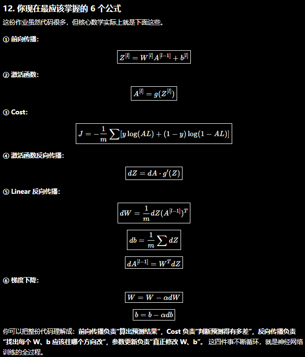

# Logistic Regression（逻辑回归）训练全过程

## 一、Forward Propagation（正向传播）

### Step 1：输入

输入特征：

x = [x₁, x₂, ..., xₙ]

权重：

w = [w₁, w₂, ..., wₙ]

偏置：

b

---

### Step 2：线性计算

首先计算：

```text
z = wᵀx + b
```

展开：

```text
z = w₁x₁ + w₂x₂ + ... + wₙxₙ + b
```

这一部分称为**线性变换**。

---

### Step 3：Sigmoid 激活函数

计算预测值：

```text
a = σ(z)
```

其中：

```text
a = 1 / (1 + e^(-z))
```

作用：

将任意实数映射到 (0,1)。

因此：

- a 越接近 1，越认为属于正类。
- a 越接近 0，越认为属于负类。

---

### Step 4：计算单个样本的 Loss

真实标签：

```text
y ∈ {0,1}
```

Loss：

```text
L(a,y) = -[ y·log(a) + (1-y)·log(1-a) ]
```

作用：

衡量预测值 a 与真实标签 y 的差距。

Loss 越小：

说明预测越准确。

---

### Step 5：计算整个数据集的 Cost

共有 m 个样本：

```text
J(w,b) = (1/m) Σ L(a⁽ⁱ⁾, y⁽ⁱ⁾)
```

展开：

```text
J(w,b)=-(1/m)*Σ [ y⁽ⁱ⁾log(a⁽ⁱ⁾)+(1-y⁽ⁱ⁾)log(1-a⁽ⁱ⁾) ]
```

整个训练真正优化的是：

```text
min J(w,b)
```

---

## 二、Backward Propagation（反向传播）

目标：

计算：

```text
               ∂J/∂w            ∂J/∂b
```

然后更新参数。

---

### Step 1：Loss 对 a 求导

```text
dL/da = -y/a + (1-y)/(1-a)
```

表示：

Loss 对预测值 a 的变化率。

---

### Step 2：Sigmoid 求导

Sigmoid：

```text
a = 1/(1+e^(-z))
```

求导：

```text
da/dz = a(1-a)
```

这是 Sigmoid 最重要的性质。

---

### Step 3：链式法则

利用：

```text
dL/dz = (dL/da) × (da/dz)
```

最终可以化简得到：

```text
dz = a - y
```

这是逻辑回归最经典的公式。

---

### Step 4：计算权重梯度

因为：

```text
z = wᵀx + b
```

所以：

```text
dw = x(a-y)
```

也可以写成：

```text
dw = x·dz
```

---

### Step 5：计算偏置梯度

```text
db = a - y
```

---

### 多个样本

首先：

```text
dz = A - Y
```

然后：

```text
dw = (1/m) X(A-Y)ᵀ
```

偏置：

```text
db = (1/m) Σ(a⁽ⁱ⁾-y⁽ⁱ⁾)
```

---

## 三、Gradient Descent（梯度下降）

更新权重：

```text
w = w - αdw
```

更新偏置：

```text
b = b - αdb
```

其中：

```text
α
```

表示学习率（Learning Rate）。

---

## 四、不断循环

Forward：

```text
x
 ↓
z = wᵀx + b
 ↓
a = sigmoid(z)
 ↓
Loss
 ↓
Cost
```

Backward：

```text
Cost
 ↓
dL/da
 ↓
da/dz
 ↓
dz = a-y
 ↓
dw
db
```

Gradient Descent：

```text
w = w - αdw

b = b - αdb
```

继续重复：

```text
Forward
    ↓
Backward
    ↓
Update
    ↓
Forward
```

直到：

```text
Cost 最小
```

# Vectorized Logistic Regression（向量化逻辑回归）

吴恩达课程中，前面的逻辑回归都是针对**单个样本**进行计算。

实际训练时，一次会处理整个训练集，因此需要使用**向量化（Vectorization）**来提高计算效率。

---

## 一、训练集表示

假设：

共有 m 个训练样本。

每个样本有 n 个特征。

训练集可以写成：

```text
X = [x¹  x²  x³  ...  xᵐ]
```

其中：

```text
X 的维度：

(n, m)
```

即：

```text
每一列：

一个训练样本

每一行：

一个特征
```

例如：

```text
        第1个  第2个  第3个

x₁      1      3      2

x₂      5      2      8

x₃      7      9      4
```

那么：

```text
X.shape = (3,3)
```

---

权重：

```text
w.shape = (n,1)
```

偏置：

```text
b

(一个标量)
```

---

## 二、向量化 Forward Propagation

### Step 1：计算 z

单个样本：

```text
z = wᵀx + b
```

整个训练集：

```text
Z = wᵀX + b
```

其中：

```text
Z.shape = (1,m)
```

表示：

```text
每一个样本对应一个 z
```

---

### Step 2：计算预测值

```text
A = sigmoid(Z)
```

即：

```text
A = 1 / (1 + e^(-Z))
```

其中：

```text
A.shape = (1,m)
```

表示：

整个训练集所有样本的预测结果。

---

### Step 3：计算 Loss

真实标签：

```text
Y.shape = (1,m)
```

Loss：

```text
L(A,Y) = -[Y·log(A)+(1-Y)log(1-A)]
```

整个训练集的 Cost：

```text
J = -(1/m) Σ[Ylog(A)+(1-Y)log(1-A)]
```

---

## 三、向量化 Backward Propagation

### Step 1：计算 dz

对于整个训练集：

```text
dZ = A - Y
```

这是整个逻辑回归最重要的公式。

```text
dZ.shape = (1,m)
```

---

### Step 2：计算 dw

梯度：

```text
dw = (1/m)X(dZ)ᵀ
```

维度：

```text
(n,m)×(m,1)=(n,1)
```

刚好与权重维度一致。

---

### Step 3：计算 db

```text
db = (1/m)Σ(dZ)
```

表示：

所有样本梯度的平均值。

---

## 四、Gradient Descent（梯度下降）

更新参数：

```text
w = w-αdw
```

更新偏置：

```text
b = b-αdb
```

其中：

```text
α
```

表示：

学习率（Learning Rate）。

---

## 五、完整流程

```text
训练集 X
      │
      ▼
Z = wᵀX + b
      │
      ▼
A = sigmoid(Z)
      │
      ▼
Cost
══════════════════════
      ▲
      │
dZ = A - Y
      │
      ▼
dw = (1/m)X(dZ)ᵀ
      │
      ▼
db = (1/m)Σ(dZ)
      │
      ▼
更新 w,b
```

---

## 六、NumPy 实现

### Forward

```python
import numpy as np
Z = np.dot(w.T, X) + b
A = 1 / (1 + np.exp(-Z))
```

---

### Backward

```python
dZ = A - Y
dw = (1 / m) * np.dot(X, dZ.T)
db = (1 / m) * np.sum(dZ)
```

---

### Gradient Descent

```python
w = w - learning_rate * dw
b = b - learning_rate * db
```

---

## 七、完整代码

```python
# Forward
Z = np.dot(w.T, X) + b
A = sigmoid(Z)

# Backward
dZ = A - Y
dw = (1/m) * np.dot(X, dZ.T)
db = (1/m) * np.sum(dZ)

# Update
w = w - learning_rate * dw
b = b - learning_rate * db
```

# Vectorized Neural Network（向量化神经网络）

## 神经网络梯度下降全流程图（Two-Layer Neural Network）

```text
                         Forward Propagation
====================================================================================

                A⁰ = X（输入）
                     │
                     │
                     ▼
            Z¹ = W¹A⁰ + b¹
                     │
                     │
                     ▼
              A¹ = g(Z¹)
                     │
                     │
                     ▼
            Z² = W²A¹ + b²
                     │
                     │
                     ▼
          A² = sigmoid(Z²)
                     │
                     │
                     ▼
                 Cost J


====================================================================================
                        Backward Propagation
====================================================================================

                 dZ² = A² - Y
                     │
         ┌───────────┴───────────┐
         │                       │
         ▼                       ▼
 dW² = (1/m)dZ²(A¹)ᵀ      db² = (1/m)ΣdZ²
         │
         ▼
 dA¹ = (W²)ᵀdZ²
         │
         ▼
 dZ¹ = dA¹ ⊙ g'(Z¹)
         │
   ┌─────┴─────┐
   │           │
   ▼           ▼
dW¹=(1/m)dZ¹Xᵀ   db¹=(1/m)ΣdZ¹


====================================================================================
                        Gradient Descent
====================================================================================

W² ← W² - αdW²

b² ← b² - αdb²

W¹ ← W¹ - αdW¹

b¹ ← b¹ - αdb¹

====================================================================================
```


逻辑回归只有一层：

```text
x
 │
 ▼
z = wᵀx + b
 │
 ▼
a = sigmoid(z)
```

神经网络是在逻辑回归的基础上增加了**隐藏层（Hidden Layer）**。

---

## 一、神经网络结构

一个两层神经网络：

```text
输入层
 x
 │
 ▼
隐藏层（Layer 1）
 │
 ▼
输出层（Layer 2）
 │
 ▼
预测结果
```

例如：

```text
        x₁
         │
        x₂
         │
        x₃
      /  |  \
     ○   ○   ○      ← Hidden Layer
      \  |  /
         ○           ← Output
```

每一个圆圈都是一个神经元（Neuron）。

---

## 二、第一层计算（Layer 1）

设：

```text
X.shape = (nₓ,m)
```

其中：

- nₓ：输入特征数
- m：训练样本数

第一层参数：

```text
W¹.shape = (n₁,nₓ)

b¹.shape = (n₁,1)
```

其中：

n₁ 表示第一层神经元数量。

---

### Step 1：线性计算

```text
Z¹ = W¹X + b¹
```

维度：

```text
(n₁,nₓ)×(nₓ,m)=(n₁,m)
```

---

### Step 2：激活函数

```text
A¹ = g¹(Z¹)
```

其中：

g¹ 表示第一层激活函数。

输出：

```text
A¹.shape = (n₁,m)
```

---

## 三、第二层计算（输出层）

第二层参数：

```text
W².shape = (n₂,n₁)

b².shape = (n₂,1)
```

计算：

```text
Z² = W²A¹ + b²
```

然后：

```text
A² = g²(Z²)
```

如果是二分类：

通常：

```text
g² = sigmoid
```

最终：

```text
A²

就是预测结果。
```

---

## 四、一般 L 层神经网络

对于任意第 l 层：

线性计算：

```text
Z[l]=W[l]A[l-1]+b[l]
```

激活：

```text
A[l]=g(Z[l])
```

其中：

```text
A[0]=X
```

表示输入数据。

因此：

整个 Forward 就是不断重复：

```text
Linear

↓

Activation

↓

Linear

↓

Activation
```

直到输出层。

---

## 五、Forward Propagation 总结

对于每一层：

```text
Z[l] = W[l]A[l-1] + b[l]

↓

A[l] = g(Z[l])
```

整个网络：

```text
A⁰ = X

↓

Z¹

↓

A¹

↓

Z²

↓

A²

↓

...

↓

AL
```

其中：

```text
AL

就是最终预测结果。
```

---


## 六、NumPy 实现

第一层：

```python
Z1 = np.dot(W1, X) + b1
A1 = g(Z1)
```

第二层：

```python
Z2 = np.dot(W2, A1) + b2
A2 = sigmoid(Z2)
```

整个 Forward：

```python
Z1 = np.dot(W1, X) + b1
A1 = relu(Z1)

Z2 = np.dot(W2, A1) + b2
A2 = sigmoid(Z2)
```

---

## 七、激活函数（Activation Function）

激活函数作用：

> 为神经网络加入非线性能力。

如果没有激活函数：

```text
Linear

↓

Linear

↓

Linear
```

多个线性层仍然等价于：

```text
一个线性层
```

因此：

神经网络将失去学习复杂函数的能力。

---

## 八、常见激活函数


### 1、Sigmoid

公式：

```text
σ(z)=1/(1+e⁻ᶻ)
```

```mermaid
xychart-beta
    title "Sigmoid"
    x-axis -6 --> 6
    y-axis 0 --> 1
    line [0.00,0.01,0.02,0.05,0.12,0.27,0.50,0.73,0.88,0.95,0.98,0.99,1.00]
```


图像特点：

- 输出范围：(0,1)
- 平滑
- 常用于二分类输出层

优点：

- 可以表示概率。

缺点：

- 梯度容易消失。 
- 解释：反向传播时，梯度越来越小，最后几乎变成 0，导致前面的参数几乎无法更新。
梯度消失不是梯度突然没有了，而是在反向传播过程中，由于链式法则不断相乘，梯度越来越小，
导致靠近输入层的参数几乎无法更新。
- 收敛速度较慢。

通常：

```text
输出层（二分类）
```

使用。

---

### 2、Tanh

公式：

```text
tanh(z)=(eᶻ-e⁻ᶻ)/(eᶻ+e⁻ᶻ)
```

```mermaid
xychart-beta
    title "Tanh"
    x-axis -6 --> 6
    y-axis -1 --> 1
    line [-1.00,-0.99,-0.96,-0.90,-0.76,-0.46,0.00,0.46,0.76,0.90,0.96,0.99,1.00]
```

输出范围：

```text
(-1,1)
```

优点：

- 均值接近 0。
- 收敛速度通常快于 Sigmoid。

缺点：

- 仍然存在梯度消失问题。

---

### 3、ReLU（Rectified Linear Unit）

公式：

```text
ReLU(z)=max(0,z)
```

```mermaid
xychart-beta
    title "ReLU"
    x-axis -6 --> 6
    y-axis 0 --> 6
    line [0,0,0,0,0,0,0,1,2,3,4,5,6]
```

```text
z<0

输出0

z>0

输出z
```

优点：

- 计算简单。
- 收敛速度快。
- 不容易梯度消失。
- 目前最常用。

缺点：

- Dead ReLU（神经元死亡）。 
- 解释：如果z<0,输出为0，导数为0，多层导数相乘任然为0，
导致无法更新参数，就好像这个神经元像"死掉"一样。
Leaky ReLU 就是把负半轴改成一个很小的斜率（如 0.01），即使输入为负，梯度也不至于变成 0

---

### 4、Leaky ReLU

公式：

```text
z<0   输出0.01z

z>0   输出z
```

```mermaid
xychart-beta
    title "Leaky ReLU"
    x-axis -6 --> 6
    y-axis -0.1 --> 6
    line [-0.12,-0.1,-0.08,-0.06,-0.04,-0.02,0,1,2,3,4,5,6]
```

优点：

解决：

```text
Dead ReLU
```

问题。

缺点：

需要人为设置：

```text
0.01
```

这个参数。

---

## 九、激活函数如何选择？

隐藏层：

优先使用：

```text
ReLU
```

如果：

ReLU 出现大量神经元死亡：

可以使用：

```text
Leaky ReLU
```

输出层：

二分类：

```text
Sigmoid
```

多分类：

```text
Softmax
```

回归：

```text
Linear（不使用激活函数）
```

---


# Gradient Descent Formula（梯度下降公式推导）

## 一、神经网络结构

一个两层神经网络如下：

```text
Input Layer

A⁰ = X
      │
      ▼
Z¹ = W¹A⁰ + b¹
      │
      ▼
A¹ = g¹(Z¹)
      │
      ▼
Z² = W²A¹ + b²
      │
      ▼
A² = sigmoid(Z²)
      │
      ▼
Cost J
```

其中：

```text
A⁰ = X                    输入数据

Z¹ = 第一层线性输出

A¹ = 第一层激活输出

Z² = 第二层线性输出

A² = 网络最终预测值
```

---

## 二、Forward Propagation（前向传播）

第一层：

```text
Z¹ = W¹A⁰ + b¹
```

```text
A¹ = g(Z¹)
```

第二层：

```text
Z² = W²A¹ + b²
```

```text
A² = sigmoid(Z²)
```

最终计算：

```text
Cost
```

整个 Forward：

```text
A⁰

↓

Z¹

↓

A¹

↓

Z²

↓

A²

↓

Cost
```

---

## 三、Backward Propagation（反向传播）

反向传播与前向传播方向完全相反。

```text
Cost

↓

A²

↓

Z²

↓

A¹

↓

Z¹

↓

W¹
```

---

### Step 1：计算 dZ²

由于输出层使用：

```text
Sigmoid

+

Cross Entropy
```

因此：

```text
dZ² = A² - Y
```

其中：

```text
dZ² = ∂J / ∂Z²
```

表示：

Cost 对第二层线性输出的梯度。

---

### Step 2：计算 dW²

Forward：

```text
Z² = W²A¹ + b²
```

因此：

```text
dW² = (1/m)dZ²(A¹)ᵀ
```

解释：

```text
输入是谁

梯度就乘谁
```

这里：

第二层输入是：

```text
A¹
```

所以：

```text
dW²=dZ²×A¹
```

---

### Step 3：计算 db²

偏置：

```text
Z² = W²A¹ + b²
```

由于：

```text
∂Z²/∂b² = 1
```

因此：

```text
db²=(1/m)ΣdZ²
```

---

### Step 4：计算 dA¹

这一部分最重要。

Forward：

```text
A¹

↓

Z²

↓

Cost
```

根据链式法则：

```text
dA¹=∂J/∂A¹
```

又因为：

```text
Z² = W²A¹ + b²
```

所以：

```text
∂Z²/∂A¹=W²
```

因此：

```text
dA¹=(W²)ᵀdZ²
```

解释：

```text
梯度继续向前传播
```

它表示：

```text
Cost

对

第一层激活值

变化多少
```

---

### Step 5：计算 dZ¹

Forward：

```text
A¹ = g(Z¹)
```

根据链式法则：

```text
dZ¹=dA¹⊙g'(Z¹)
```

其中：

```text
⊙
```

表示：

```text
逐元素相乘
```

如果：

```text
ReLU
```

那么：

```text
g'(z)=

1(z>0)
0(z≤0)
```

如果：

```text
Sigmoid
```

那么：

```text
g'(z)=a(1-a)
```

---

### Step 6：计算 dW¹

Forward：

```text
Z¹ = W¹X + b¹
```

因此：

```text
dW¹=(1/m)dZ¹Xᵀ
```

解释：

第一层输入就是：

```text
X
```

所以：

```text
梯度

×

输入
```

---

### Step 7：计算 db¹

同理：

```text
db¹=(1/m)ΣdZ¹
```

---

## 四、Gradient Descent（梯度下降）

更新第二层参数：

```text
W²=W²-αdW²
b²=b²-αdb²
```


更新第一层参数：

```text
W¹=W¹-αdW¹
b¹=b¹-αdb¹
```


---

## 五、完整流程

```text
Forward

A⁰ = X
      │
      ▼
Z¹ = W¹A⁰ + b¹
      │
      ▼
A¹ = g(Z¹)
      │
      ▼
Z² = W²A¹ + b²
      │
      ▼
A² = sigmoid(Z²)
      │
      ▼
Cost


═══════════════════════════════════

Backward

Cost
      │
      ▼
dZ² = A² - Y
      │
      ├──────────────► dW² = (1/m)dZ²(A¹)ᵀ
      │
      ├──────────────► db² = (1/m)ΣdZ²
      │
      ▼
dA¹ = (W²)ᵀdZ²
      │
      ▼
dZ¹ = dA¹ ⊙ g'(Z¹)
      │
      ├──────────────► dW¹ = (1/m)dZ¹Xᵀ
      │
      └──────────────► db¹ = (1/m)ΣdZ¹


═══════════════════════════════════

Update

W² ← W² - αdW²

b² ← b² - αdb²

W¹ ← W¹ - αdW¹

b¹ ← b¹ - αdb¹
```

---

## 六、每个变量的物理意义

| 变量 | 含义 |
|------|------|
| A⁰ | 输入数据 X |
| Z¹ | 第一层线性计算结果 |
| A¹ | 第一层激活后的输出 |
| Z² | 第二层线性计算结果 |
| A² | 网络预测值 |
| dZ² | Cost 对 Z² 的梯度 |
| dW² | 第二层权重梯度 |
| db² | 第二层偏置梯度 |
| dA¹ | Cost 对 A¹ 的梯度（梯度继续向前传播） |
| dZ¹ | Cost 对 Z¹ 的梯度（穿过激活函数） |
| dW¹ | 第一层权重梯度 |
| db¹ | 第一层偏置梯度 |

---

## 七、核心公式（必须记住）

```text
Forward：

Z[l] = W[l]A[l-1] + b[l]

A[l] = g(Z[l])

────────────────────────

Backward：

dZ[L] = A[L] - Y

dW[l] = (1/m)dZ[l](A[l-1])ᵀ

db[l] = (1/m)ΣdZ[l]

dA[l-1] = (W[l])ᵀdZ[l]

dZ[l-1] = dA[l-1] ⊙ g'(Z[l-1])

────────────────────────

Update：

W[l] = W[l] - αdW[l]

b[l] = b[l] - αdb[l]
```

# Bias and Variance（偏差与方差）

## 偏差（Bias）

**定义：**

模型过于简单，无法很好地拟合训练数据。

特点：

```text
Training Error：高

Dev Error：高
```

现象：

```text
Training Accuracy：低

Dev Accuracy：低
```

原因：

- 模型太简单
- 神经元数量过少
- 网络层数过少
- 训练次数不足

对应问题：

```text
Underfitting（欠拟合）
```

解决方法：

- 增加网络层数（Larger Neural Network）
- 增加神经元数量
- 训练更长时间
- 更换更好的网络结构

---

## 方差（Variance）

**定义：**

模型过于复杂，在训练集表现很好，但泛化能力差。

特点：

```text
Training Error：低

Dev Error：高
```

现象：

```text
Training Accuracy：高

Dev Accuracy：低
```

原因：

模型记住了训练集，而没有学会数据规律。

对应问题：

```text
Overfitting（过拟合）
```

解决方法：

- 更多训练数据
- Regularization（正则化）
- Dropout
- Data Augmentation（数据增强）

---

## 判断模型问题

| 情况 | Training Error | Dev Error | 问题 |
|------|---------------|-----------|------|
| 高 | 高 | High Bias |
| 低 | 高 | High Variance |
| 低 | 低 | Good Fit |

---

# Regularization（正则化）

## 作用

目的：

```text
Reduce Overfitting
通过增强代价函数的影响，缩小w变化的速率，进而解决过拟合的问题
```

即：

```text
降低模型复杂度

↓

提高泛化能力
```

---
## L2 Regularization

原始 Cost Function

```text
J(W,b)=(1/m) Σ L(ŷ,y)
```

---


加入正则项：

```text
J(W,b) = (1/m) ΣL(ŷ,y) + (λ/2m) Σ||W||²
```

对于单层网络：

```text
J = (1/m)ΣL + (λ/2m)Σw²
```

其中：

```text
λ
```

表示：

```text
Regularization Parameter
平衡参数
```

---

### 梯度下降

原来：

```text
W = W - α dW
```

加入 L2 后：

```text
W = W - α( dW + (λ/m) W )
```

整理：

```text
W = (1-αλ/m)W - αdW
```

因此：

每次更新都会使权重缩小。

所以：

```text
L2 Regularization

=

Weight Decay
```

---

### 为什么能降低过拟合？

较大的权重：

```text
↓

模型变化剧烈

↓

容易拟合噪声

↓

Overfitting
```

L2 正则化：

```text
限制权重大小

↓

模型更加平滑

↓

泛化能力更强
```

---

### L1 Regularization

损失函数：

```text
J = (1/m)ΣL + (λ/m)Σ|w|
```

特点：

```text
很多权重直接变成0
```

因此：

```text
Feature Selection（特征选择）
```

现代深度学习中：

```text
L2 使用远多于 L1
```

---
## Dropout Regularization

### 作用

目的：

```text
随机关闭（Drop）部分神经元

↓

防止神经元之间相互依赖

↓

Reduce Overfitting
```

---

### 基本思想

训练过程中：

随机将部分神经元的输出置为 0。

例如：

```text
A¹

↓

[0.8]

[0]

[0.3]

[0]

[0.6]
```

其中：

```text
0
```

表示该神经元本次训练被关闭（Drop）。

下一次训练时：

关闭的神经元会重新随机选择。

因此：

```text
每一次训练

↓

都会得到一个不同的神经网络
```

---

### Keep Probability

设：

```text
keep_prob = 0.8
```

表示：

```text
80%

神经元保留

20%

神经元随机关闭
```

其中：

```text
keep_prob 越小

↓

正则化效果越强
```

---

### Inverted Dropout

训练阶段：

```text
A = A * D
```

其中： D 为随机生成的掩码（Mask）：

```text
D =
[1
 0
 1
 1
 0]
```

随后：

```text
A = A / keep_prob
```

目的：

```text
保持激活值的期望不变
```

因此：

测试阶段：

```text
无需再进行任何缩放
```

---

### 为什么能降低过拟合？

随机关闭神经元：

```text
↓

每个神经元不能依赖其他固定神经元

↓

学习更加鲁棒的特征

↓

提高泛化能力
```

可以理解为：

```text
训练了许多个不同的神经网络

↓

最终综合这些网络的效果
```

---

### Dropout 的特点

优点：

```text
✓ 降低过拟合

✓ 提高泛化能力

✓ 深度神经网络中效果明显
```

缺点：

```text
✓ 收敛速度变慢

✓ 增加训练随机性

✓ 不适用于输出层
```

---

### 使用建议

```text
输入层：

通常不使用 Dropout

↓

隐藏层：

推荐使用 Dropout

↓

输出层：

一般不使用 Dropout
```

现代深度学习中：

```text
L2 Regularization

+

Dropout

是最常用的两种正则化方法
```
## 其他正则化方法
### Early Stopping（提前停止）

#### 作用

目的：

```text
训练过程中

↓

在 Dev Error 开始上升时

↓

提前停止训练

↓

Reduce Overfitting
```

---

#### 基本思想

随着训练进行：

```text
Training Error

↓

持续下降
```

而：

```text
Dev Error

↓

先下降

↓

后上升
```

因此：

```text
选择 Dev Error 最小时的模型

↓

停止训练
```

---

#### 特点

优点：

```text
✓ 实现简单

✓ 节省训练时间

✓ 防止过拟合
```

缺点：

```text
不能完全替代 L2 Regularization
```

---

### Data Augmentation（数据增强）

#### 作用

目的：

```text
增加训练数据

↓

提高泛化能力

↓

Reduce Overfitting
```

---

#### 常见方法

图像：

```text
随机裁剪

随机翻转

随机旋转

颜色扰动

缩放
```

文本：

```text
同义词替换

随机删除

随机插入

随机交换
```

---

#### 特点

```text
不改变标签

↓

增加数据多样性

↓

提高模型泛化能力
```

---

### Batch Normalization（批量归一化）

#### 作用

目的：

```text
标准化每层输入

↓

加快训练速度

↓

提高模型稳定性

↓

一定程度降低过拟合
```

---

#### 特点

```text
训练更稳定

允许使用更大学习率

具有轻微正则化效果
```

现代深度学习中：

```text
Batch Normalization

+

Dropout

通常不会同时大量使用
```

---

### Noise Injection（加入噪声）

#### 作用

训练过程中：

```text
向输入

或

隐藏层

加入随机噪声
```

作用：

```text
提高模型鲁棒性

↓

Reduce Overfitting
```

---

### Label Smoothing（标签平滑）

#### 作用

原始标签：

```text
[1,0,0]
```

修改为：

```text
[0.9,0.05,0.05]
```

作用：

```text
避免模型过于自信

↓

提高泛化能力
```

常用于：

```text
分类任务

Transformer

Vision Transformer
```


# Parameters vs Hyperparameters（参数与超参数）

## Parameters（模型参数）

训练过程中自动学习得到。

包括：

```text
W

b
```

例如：

```text
Z=WX+b
```

训练目标：

```text
Gradient Descent

↓

不断更新 W、b

↓

最小化 Cost Function
```

---

## Hyperparameters（超参数）

训练开始之前人工设定。

训练过程中不会自动学习。

常见超参数：

```text
Learning Rate（α）

Number of Iterations （迭代次数）

Number of Hidden Layers

Number of Hidden Units

Activation Function

Mini-batch Size

Regularization Parameter（λ）
```

---

## Parameters 与 Hyperparameters 区别

| Parameters | Hyperparameters |
|------------|-----------------|
| W、b | α、λ |
| 自动学习 | 人工设定 |
| 每次训练都会变化 | 训练前确定 |
| Gradient Descent 更新 | 不参与梯度下降 |

---

## 不同情况所需调整参数

首先判断模型属于哪一种情况，再决定调整 **Parameters** 还是 **Hyperparameters**。

| 情况 | 表现 | 原因 | 优先调整 |
|------|------|------|----------|
| High Bias（欠拟合） | Training Error 高，Dev Error 高 | 模型学习能力不足 | Hyperparameters |
| High Variance（过拟合） | Training Error 低，Dev Error 高 | 模型过于复杂，泛化能力差 | Hyperparameters |
| Training Error、Dev Error 都低 | 模型表现良好 | 无需调整 | 无 |
| Training Error 很高，Loss 不下降 | 模型没有收敛 | 学习率、训练次数等设置不合理 | Hyperparameters |

---

### High Bias（欠拟合）

特点：

```text
Training Error：高

Dev Error：高
```

优先调整：

```text
✓ 增加 Hidden Layers

✓ 增加 Hidden Units

✓ 增加 Iterations

✓ 更换 Activation Function

✓ 减小 λ（Regularization）
```

一般**不需要直接修改 Parameters**，因为：

```text
Parameters（W、b）

↓

Gradient Descent 会自动学习
```

真正需要调整的是影响学习能力的 **Hyperparameters**。

---

### High Variance（过拟合）

特点：

```text
Training Error：低

Dev Error：高
```

优先调整：

```text
✓ 增加 Training Data

✓ 增大 λ（L2 Regularization）

✓ 使用 Dropout

✓ Data Augmentation

✓ Early Stopping
```

如果网络过大，也可以：

```text
减少 Hidden Units

减少 Hidden Layers
```

---

### 模型无法收敛

表现：

```text
Training Error 一直很高

Cost 几乎不下降
```

优先检查：

```text
✓ Learning Rate α 是否过大

✓ Learning Rate α 是否过小

✓ Iterations 是否足够

✓ 参数初始化是否合理
```

---

### Parameters 与 Hyperparameters 的区别

训练过程中：

```text
Parameters（W、b）

↓

自动更新

↓

Gradient Descent
```

开发过程中：

```text
Hyperparameters

↓

人工调整

↓

重新训练模型
```

因此：

```text
发现模型效果不好

↓

不要手动修改 W、b

↓

而是调整 Hyperparameters
```

---

### 调参流程

```text
开始训练
      │
      ▼
观察 Training Error
      │
      ├──────── 高
      │
      ▼
High Bias（欠拟合）
      │
      ▼
增加模型容量
增加训练次数
减小 λ
调整学习率
══════════════════════════════
      │
Training Error 低
      │
      ▼
观察 Dev Error
      │
      ├──────── 高
      │
      ▼
High Variance（过拟合）
      │
      ▼
增加数据
L2 Regularization
Dropout
Data Augmentation
══════════════════════════════
      │
Dev Error 低
      │
      ▼
模型训练完成
```

## 总结

```text
Parameters

↓

模型学习得到

↓

W、b

────────────────────────

Hyperparameters

↓

人为设定

↓

Learning Rate

Iterations

Layers

Hidden Units

Activation

λ
```


# Optimization Algorithms（算法优化）

## Mini-batch Gradient Descent（小批量梯度下降）

普通 Batch Gradient Descent 每次使用**整个训练集**计算梯度：

```text
X → Forward → Cost → Backward → dw, db → Update
```

当训练集很大时，每次计算都需要遍历全部数据，训练速度较慢。

因此可以把训练集划分成多个 **Mini-batch（小批量）**。

例如：

```text
训练集：1000 个样本

Mini-batch 1：0 ~ 63
Mini-batch 2：64 ~ 127
...
```

设：

```text
mini-batch size = 64
```

则每次只使用 64 个样本计算梯度。

梯度下降：

```text
W = W - αdW
b = b - αdb
```

其中：

```text
α：Learning Rate
```

Mini-batch 的核心思想：

```text
Batch Gradient Descent
一次使用全部数据
        ↓
计算准确，但速度较慢

Mini-batch Gradient Descent
一次使用一小部分数据
        ↓
计算速度快，并且可以利用向量化
```

### 三种梯度下降比较

```text
Batch GD：
一次使用 m 个样本

Stochastic GD：
一次使用 1 个样本

Mini-batch GD：
一次使用 1~m 个样本
```

通常：

```text
Mini-batch GD
```

在速度和稳定性之间取得较好的平衡。

### NumPy 实现

```python
for mini_batch in mini_batches:

    X_batch, Y_batch = mini_batch

    # Forward
    Z = np.dot(W, X_batch) + b
    A = sigmoid(Z)

    # Backward
    dZ = A - Y_batch
    dW = (1 / mini_batch_size) * np.dot(dZ, X_batch.T)
    db = (1 / mini_batch_size) * np.sum(dZ)

    # Update
    W = W - learning_rate * dW
    b = b - learning_rate * db
```

---

## Exponentially Weighted Averages（指数加权平均）

指数加权平均用于对历史数据进行**平滑处理**。

基本公式：

```text
V_t = β * V_{t-1} + (1-β) * θ_t
```

其中：

```text
β：权重参数
θ_t：当前数据
V_t：当前加权平均值
```

例如：

```text
β = 0.9
```

表示：

```text
V_t
≈ 0.9 × 历史平均
 + 0.1 × 当前数据
```

展开：

```text
V_t
= β * V_{t-1} + (1-β) * θ_t

= β² * V_{t-2} + β * (1-β) * θ_{t-1} + (1-β) * θ_t
```

因此越近的数据权重越大。

```text
β 越大
↓
平均更加平滑
↓
考虑更多历史数据

β 越小
↓
更加关注当前数据
```

在梯度下降中，可以利用指数加权平均记录历史梯度，从而减少梯度更新的剧烈波动。

---

## Momentum（动量梯度下降）

Momentum 的核心思想：

> 不仅考虑当前梯度，还考虑之前的梯度方向。

首先计算梯度的指数加权平均：

```text
V_{dW} = βV_{dW} + (1-β)dW

V_{db} = βV_{db} + (1-β)db
```

然后使用这个平均梯度更新参数：

```text
W = W - αV_{dW}

b = b - αV_{db}
```

普通 Gradient Descent：

```text
W = W - αdW
```

Momentum：

```text
W = W - αV_{dW}
```

因此：

```text
当前梯度
   +
历史梯度
   ↓
Momentum
   ↓
更加平滑的更新方向
```

### 作用

Momentum 可以：

```text
减少上下震荡
      ↓
让参数更稳定地向最优方向移动
      ↓
加快收敛速度
```

常用：

```text
β ≈ 0.9
```

### NumPy 实现

```python
VdW = beta * VdW + (1 - beta) * dW
Vdb = beta * Vdb + (1 - beta) * db

W = W - learning_rate * VdW
b = b - learning_rate * Vdb
```

---

## RMSprop（均方根传播）

RMSprop 的核心思想：

> 对梯度的平方进行指数加权平均，根据梯度大小自动调整参数的更新步长。

首先计算：

```text
S_{dW}
= β * S_{dW} + (1-β) * (dW)²

S_{db}
= β * S_{db} + (1-β) * (db)²
```

然后更新：

```text
W = W - α dW / (√S_{dW} + ε)

b = b - α db / (√S_{db} + ε)
```

其中：

```text
ε
```

是一个很小的数，用于防止除以 0。

核心思想：

```text
梯度较大
↓
S 较大
↓
更新步长变小

梯度较小
↓
S 较小
↓
更新步长相对变大
```

因此 RMSprop 可以：

```text
减少某些方向上的剧烈震荡
+
调整不同方向的学习步长
```

### NumPy 实现

```python
SdW = beta * SdW + (1 - beta) * (dW ** 2)
Sdb = beta * Sdb + (1 - beta) * (db ** 2)

W = W - learning_rate * dW / (np.sqrt(SdW) + epsilon)
b = b - learning_rate * db / (np.sqrt(Sdb) + epsilon)
```

---

## Adam（Adaptive Moment Estimation）

Adam = **Momentum + RMSprop**

它同时使用：

```text
Momentum
↓
计算梯度的一阶矩

RMSprop
↓
计算梯度平方的二阶矩
```

首先计算一阶矩：

```text
V_{dW}
= β₁V_{dW} + (1-β₁)dW
```

计算二阶矩：

```text
S_{dW}
= β₂S_{dW} + (1-β₂)(dW)²
```

然后进行偏差修正：

```text
V_corrected
= V_{dW} / (1-β₁^t)

S_corrected
= S_{dW} / (1-β₂^t)
```

最后更新：

```text
W = W - α
    V_corrected
    ----------------
    √S_corrected + ε
```

偏置同理：

```text
b = b - α
    V_corrected_b
    ----------------
    √S_corrected_b + ε
```

常用超参数：

```text
β₁ = 0.9

β₂ = 0.999

ε = 10⁻⁸
```

Adam 的优势：

```text
Momentum
    ↓
利用历史梯度方向

RMSprop
    ↓
根据梯度大小调整步长

        ↓

      Adam

        ↓

通常具有较好的收敛速度和稳定性
```

### NumPy 实现

```python
# First moment
VdW = beta1 * VdW + (1 - beta1) * dW

# Second moment
SdW = beta2 * SdW + (1 - beta2) * (dW ** 2)

# Bias correction
VdW_corrected = VdW / (1 - beta1 ** t)
SdW_corrected = SdW / (1 - beta2 ** t)

# Update
W = W - learning_rate * VdW_corrected / (
    np.sqrt(SdW_corrected) + epsilon
)
```

实际深度学习中： Adam 是非常常用的优化算法。

---

## Learning Rate Decay（学习速率衰减）

训练刚开始时：

```text
参数距离最优点较远
```

通常希望：

```text
Learning Rate 较大
```

这样可以快速接近最优区域。

训练后期：

```text
参数已经接近最优点
```

如果学习率仍然很大：

```text
可能在最优点附近来回震荡
```

因此可以让学习率随着训练进行逐渐减小：

```text
α ↓
```

这就是：

```text
Learning Rate Decay
```

一种常见形式：

```text
α = α₀ / (1 + decay_rate × epoch_num)
```

其中：

```text
α₀：初始学习率

decay_rate：衰减率

epoch_num：当前训练轮数
```

例如：

```text
epoch 越大
↓
α 越小
```

### 另一种形式

也可以使用指数衰减：

```text
α = α₀ × decay_rate^{epoch_num}
```

核心思想：

```text
训练初期：

α 大
↓
快速学习

训练后期：

α 小
↓
稳定收敛
```

### NumPy 实现

```python
learning_rate = learning_rate_0 / (
    1 + decay_rate * epoch_num
)
```

---

## Local Optima（局部最优解）

梯度下降的目标：

```text
minimize J(W,b)
```

理论上可能存在：

```text
Global Minimum
全局最优

Local Minimum
局部最优

Saddle Point
鞍点
```

### Local Minimum

局部最优点满足：

```text
当前位置附近：

Cost 都比当前位置高
```

因此梯度：

```text
∇J ≈ 0
```

梯度下降可能停留在这里。

---

### Saddle Point（鞍点）

在高维神经网络中，真正需要关注的往往不是局部最小值，而是：

```text
Saddle Point
```

鞍点的特点：

```text
某些方向：

Cost 增大

另一些方向：

Cost 减小
```

因此它不是一个真正的局部最小值。

示意：

```text
       ↑ Cost
       │
       │    ╲
       │     ╲
       │      ●
       │     ╱
       │    ╱
       └────────→
```

在鞍点附近：

```text
∇J ≈ 0
```

所以梯度下降可能暂时移动得非常缓慢。

---

### 为什么现代深度网络不太担心 Local Minimum？

神经网络通常具有：

```text
大量参数
+
高维参数空间
```

在高维空间中：

```text
真正糟糕的 Local Minimum
```

并不是最主要的问题。

更常见的问题是：

```text
Saddle Point
+
平坦区域（Plateau）
```

因此：

```text
优化算法的目标

不是简单地寻找一个“完美的全局最小值”

而是：

找到一个足够低、泛化能力好的 Cost
```

Momentum、RMSprop、Adam 等优化算法可以帮助梯度下降：

```text
更快通过平坦区域
+
减少震荡
+
提高训练速度
```

---

## 总结

```text
Mini-batch GD
↓
每次只使用一小批训练数据
↓
提高计算效率


Momentum
↓
利用历史梯度
↓
减少震荡


RMSprop
↓
利用梯度平方的指数加权平均
↓
自动调整不同方向的更新步长


Adam
↓
Momentum + RMSprop
↓
常用且效果较好的优化算法


Learning Rate Decay
↓
随着训练进行
↓
逐渐减小 α


Local Optima / Saddle Point
↓
梯度可能接近 0
↓
训练速度变慢
↓
优化算法帮助模型更稳定、更快地收敛
```

### 核心公式

```text
────────────────────────────

Mini-batch：

W = W - αdW


────────────────────────────

Momentum：

VdW = βVdW + (1-β)dW

W = W - αVdW


────────────────────────────

RMSprop：

SdW = βSdW + (1-β)(dW)²

W = W - αdW/(√SdW + ε)


────────────────────────────

Adam：

VdW = β₁VdW + (1-β₁)dW

SdW = β₂SdW + (1-β₂)(dW)²

V_corrected = VdW/(1-β₁ᵗ)

S_corrected = SdW/(1-β₂ᵗ)

W = W - αV_corrected/(√S_corrected+ε)


────────────────────────────

Learning Rate Decay：

α = α₀/(1+decay_rate×epoch_num)
```
# 超参数调试、归一化网络、程序框架

## 调试处理（Tuning Process）

超参数（Hyperparameters）是在训练之前人为设定的参数，例如：

```text
Learning Rate α
β₁、β₂
Mini-batch Size
Number of Hidden Units
Number of Layers
Regularization λ
```

不同超参数组合会得到不同的模型，因此需要通过 **Dev Set** 选择合适的超参数。

基本流程：

```text
设置一组超参数
      ↓
训练模型
      ↓
在 Dev Set 上评价
      ↓
调整超参数
      ↓
重新训练
      ↓
选择表现最好的模型
```

评价标准可以是：

```text
Dev Error 越低 → 越好

Dev Accuracy 越高 → 越好
```

### 超参数调试的基本方法

不要只调整一个参数然后认为一定是最优的，而应该：

```text
尝试多组超参数
      ↓
比较 Dev Set 表现
      ↓
选择最好的组合
```

常见方法：

```text
Grid Search
随机搜索（Random Search）
```

深度学习中通常更推荐：

```text
Random Search
```

因为不同超参数的重要程度往往不同。

---

## 选择合适数轴取值（Choosing Appropriate Scales）

不同超参数适合使用不同的取值范围。

例如学习率：

```text
α ∈ [0.0001, 1]
```

如果直接均匀取：

```text
0.0001
0.1
0.2
0.3
...
1
```

大量搜索空间都会集中在较大的学习率区域。

对于跨度很大的参数，更适合使用**对数尺度（Log Scale）**。

例如：

```text
10⁻⁴
10⁻³
10⁻²
10⁻¹
10⁰
```

即：

```text
0.0001
0.001
0.01
0.1
1
```

### 随机取值

例如：

```python
import numpy as np

r = np.random.uniform(-4, 0)

learning_rate = 10 ** r
```

这样就可以在：

```text
[10⁻⁴, 10⁰]
```

范围内随机选择学习率。

核心思想：

```text
参数跨度小
↓
普通均匀取值

参数跨度大
↓
使用对数尺度
```

对于：

```text
Learning Rate
β
Regularization λ
```

尤其需要注意取值范围。

---

## Batch Normalization（批量归一化）

Batch Normalization（BN）的作用是：

```text
对神经网络中间层的激活值进行归一化
↓
使训练更加稳定
↓
加快训练速度
```

对于一个 mini-batch：

首先计算均值：

$$
\mu = \frac{1}{m}\sum_{i=1}^{m}z^{(i)}
$$

计算方差：

$$
\sigma^2 = \frac{1}{m}\sum_{i=1}^{m}(z^{(i)}-\mu)^2
$$

进行归一化：

$$
\tilde{z}^{(i)}
=
\frac{z^{(i)}-\mu}
{\sqrt{\sigma^2+\epsilon}}
$$

然后加入可学习参数：

$$
\hat{z}^{(i)}
=
\gamma\tilde{z}^{(i)}+\beta
$$

其中：

```text
γ：缩放参数
β：平移参数
ε：防止除以 0
```

因此：

```text
Z
 ↓
Normalization
 ↓
Z~
 ↓
γZ~ + β
 ↓
激活函数
 ↓
A
```

### NumPy 实现

```python
mu = np.mean(Z, axis=0)
var = np.var(Z, axis=0)

Z_norm = (Z - mu) / np.sqrt(var + epsilon)

Z_tilde = gamma * Z_norm + beta
```

### Batch Normalization 的作用

```text
✓ 加快训练

✓ 使训练更加稳定

✓ 可以使用较大的 Learning Rate

✓ 对初始化不那么敏感

✓ 具有一定的正则化效果
```

---

## Softmax Classification（Softmax 分类器）

Softmax 用于**多分类问题**。

例如：

```text
猫
狗
鸟
```

与二分类的 Sigmoid 不同：

```text
Sigmoid
↓
输出一个概率
```

Softmax：

```text
输出多个类别的概率
```

假设有 $C$ 个类别：

$$
a_i
===

\frac{e^{z_i}}
{\sum_{j=1}^{C}e^{z_j}}
$$

因此：

$$
\sum_{i=1}^{C}a_i=1
$$

每一个：

```text
a_i
```

都可以理解为属于第 $i$ 类的概率。

例如：

```text
猫：0.70
狗：0.20
鸟：0.10
```

那么：

```text
预测结果 = 猫
```

因为：

```text
0.70 最大
```

### NumPy 实现

```python
Z_exp = np.exp(Z)

A = Z_exp / np.sum(Z_exp, axis=0, keepdims=True)
```

实际实现中通常使用更加稳定的写法：

```python
Z_exp = np.exp(Z - np.max(Z, axis=0, keepdims=True))

A = Z_exp / np.sum(Z_exp, axis=0, keepdims=True)
```

减去最大值不会改变 Softmax 的结果，但可以避免指数运算出现数值溢出。

### Softmax + Cross Entropy

多分类通常使用：

```text
Softmax
+
Cross Entropy Loss
```

损失函数：

$$
L=-\sum_{i=1}^{C}y_i\log(a_i)
$$

其中：

```text
y_i：真实标签
a_i：模型预测概率
```

Softmax 输出：

```text
[0.1, 0.7, 0.2]
```

真实标签：

```text
[0, 1, 0]
```

则：

```text
Loss = -log(0.7)
```

---

## TensorFlow

TensorFlow 可以自动完成：

```text
Forward Propagation
+
Cost Calculation
+
Backward Propagation
+
Gradient Descent
```

因此不需要手动推导和计算所有梯度。

### 定义变量

```python
import tensorflow as tf

W = tf.Variable(3.0)
b = tf.Variable(1.0)
```

`tf.Variable` 表示：

```text
需要在训练过程中不断更新的参数
```

例如：

```text
W
b
```

---

### Forward Propagation

例如：

```python
x = tf.constant(2.0)

with tf.GradientTape() as tape:
    z = W * x + b
    loss = z ** 2
```

TensorFlow 会记录计算过程。

---

### 自动计算梯度

```python
dw, db = tape.gradient(loss, [W, b])
```

得到：

```text
dw = ∂Loss / ∂W

db = ∂Loss / ∂b
```

不需要手动进行反向传播公式推导。

---

### 更新参数

```python
W.assign_sub(learning_rate * dw)
b.assign_sub(learning_rate * db)
```

等价于：

$$
W=W-\alpha dW
$$

$$
b=b-\alpha db
$$

---

### TensorFlow 训练流程

```text
输入数据
   ↓
Forward Propagation
   ↓
计算 Loss
   ↓
GradientTape
   ↓
自动计算梯度
   ↓
更新 W、b
   ↓
重复训练
```

### 使用优化器

TensorFlow 通常直接使用优化器：

```python
optimizer = tf.keras.optimizers.Adam(
    learning_rate=0.001
)
```

训练时：

```python
with tf.GradientTape() as tape:
    predictions = model(X)
    loss = loss_function(Y, predictions)

gradients = tape.gradient(
    loss,
    model.trainable_variables
)

optimizer.apply_gradients(
    zip(gradients, model.trainable_variables)
)
```

这样 TensorFlow 会自动完成：

```text
Forward
↓
Loss
↓
Gradient
↓
Parameter Update
```

---

## 总结

```text
Hyperparameter Tuning
        ↓
通过 Dev Set 比较不同超参数
        ↓
选择表现最好的组合


Batch Normalization
        ↓
归一化中间层激活值
        ↓
训练更加稳定、速度更快


Softmax
        ↓
多分类问题
        ↓
输出所有类别的概率
        ↓
概率之和 = 1


TensorFlow
        ↓
自动计算梯度
        ↓
自动更新参数
        ↓
简化神经网络训练
```

### 核心公式


Batch Normalization：

$$
\mu = \frac{1}{m}\sum_{i=1}^{m}z^{(i)}
$$

$$
\sigma^2
= 
\frac{1}{m}
\sum_{i=1}^{m}
(z^{(i)}-\mu)^2
$$

$$
\tilde{z}^{(i)}
=
\frac{z^{(i)}-\mu}
{\sqrt{\sigma^2+\epsilon}}
$$

$$
\hat{z}^{(i)}
=
\gamma\tilde{z}^{(i)}+\beta
$$


Softmax：

$$
a_i
=
\frac{e^{z_i}}
{\sum_{j=1}^{C}e^{z_j}}
$$

$$
\sum_{i=1}^{C}a_i=1
$$


Cross Entropy：

$$
L=-\sum_{i=1}^{C}y_i\log(a_i)
$$


# 机器学习策略（1）（ML Strategy 1）

这一周的重点不是学习新的神经网络结构，而是学习如何判断一个机器学习项目当前真正的问题，以及如何选择最值得尝试的改进方向。

核心思想可以概括为：

```text
定义正确的目标
        ↓
建立合适的 Train / Dev / Test 集合
        ↓
快速建立一个可工作的基线系统
        ↓
分析 Bias、Variance 和 Human-level performance
        ↓
通过误差分析决定下一步工作
```

## 一、为什么需要 ML Strategy？

在深度学习项目中，通常有很多可能的改进方向：

- 收集更多数据；
- 收集更多样化的数据；
- 训练更长时间；
- 更换优化算法，例如 Adam；
- 使用更大的网络或更小的网络；
- 使用 L2 Regularization 或 Dropout；
- 修改神经网络结构、激活函数或隐藏单元数量；
- 调整各种 Hyperparameters。

问题在于，时间和计算资源是有限的。如果没有一套分析方法，就可能在错误的方向上浪费几周甚至几个月。

机器学习项目通常应该遵循一个快速迭代的流程：

```text
设置 Dev / Test 集和评价指标
        ↓
快速建立初始系统
        ↓
在 Dev 集上观察错误
        ↓
进行 Bias / Variance 分析和 Error Analysis
        ↓
优先选择最有希望的改进方向
        ↓
重复迭代
```

## 二、Orthogonalization（正交化）

正交化的思想是：让每一个旋钮尽量只负责一个明确的目标。

对于一个监督学习系统，通常可以把目标拆成以下四步：

1. 在 Training set 上取得较好的表现；
2. 让模型能够从 Training set 泛化到 Dev set；
3. 让模型能够从 Dev set 泛化到 Test set；
4. 让系统在真实应用中表现良好。

不同问题应该使用不同的解决方法：

| 现象 | 通常优先尝试的方向 |
| --- | --- |
| Training error 很高 | 更大的网络、训练更久、更好的优化算法、调整网络结构 |
| Training error 很低但 Dev error 很高 | 正则化、更多训练数据、数据增强、调整模型结构 |
| Dev error 很低但 Test error 很高 | 增大 Dev set，检查是否过拟合了 Dev set |
| Dev/Test 表现好但真实应用效果差 | 重新定义评价指标，或重新构造 Dev/Test set |

正交化的好处是：当我们发现某一个目标没有达到时，可以优先调整负责这个目标的旋钮，而不是同时修改很多东西。

## 三、Single Number Evaluation Metric（单一数字评价指标）

### 1. 为什么需要单一指标？

如果同时使用 Accuracy、Precision、Recall、运行时间和内存占用等多个指标，就很难快速判断两个模型谁更好，也会降低团队迭代的速度。

例如：

| Classifier | Precision | Recall |
| --- | ---: | ---: |
| A | 95% | 90% |
| B | 98% | 85% |

此时很难直接说 A 或 B 更好。一个常见的做法是把 Precision 和 Recall 合并成一个数字，例如 F1 Score：

$$
F_1=\frac{2}{\frac{1}{P}+\frac{1}{R}}
$$

也可以写成：

$$
F_1=\frac{2PR}{P+R}
$$

其中：

- $P$ 是 Precision（查准率）；
- $R$ 是 Recall（查全率）。

### 2. Optimizing metric 和 Satisficing metric

有时一个指标无法表达全部需求。例如一个模型不仅要准确，还必须满足运行时间和内存限制：

| Classifier | Accuracy | Running time | Memory |
| --- | ---: | ---: | ---: |
| A | 97% | 1 s | 200 MB |
| B | 96% | 100 ms | 20 MB |
| C | 95% | 50 ms | 10 MB |

此时可以定义：

- **Optimizing metric**：真正要最大化或最小化的指标，例如 Accuracy；
- **Satisficing metric**：只要达到要求即可的指标，例如运行时间和内存。

例如：

```text
最大化 Accuracy
约束：Running time < 100 ms
      Memory < 30 MB
```

一般规则是：

```text
N 个指标中选择 1 个 Optimizing metric
其余 N-1 个作为 Satisficing metrics
```

评价指标必须真正反映产品目标。如果模型在指标上表现更好，但用户实际体验更差，就应该重新设计评价指标。

## 四、Train / Dev / Test 集的划分

### 1. Dev 集和 Test 集必须来自同一分布

- **Training set**：用于学习模型参数；
- **Dev set（Development / Hold-out / Validation set）**：用于选择模型和调节超参数；
- **Test set**：用于最后一次、尽量无偏地评估模型。

Dev set 和 Test set 应该来自相同的数据分布，并且要尽量接近模型未来真正面对的数据分布。

```text
Training set：用来训练
Dev set：用来决定“哪个模型更好”
Test set：用来估计最终的真实表现
```

如果 Dev set 是来自普通用户上传的图片，而 Test set 是来自实际安防摄像头的图片，那么在 Dev set 上调出来的模型不一定适合真正的应用场景。

### 2. 数据集大小

在数据量较小时，常见的划分方式是：

```text
70% Training / 30% Test
60% Training / 20% Dev / 20% Test
```

但在现代深度学习中，如果样本数达到百万级，通常不需要给 Dev 和 Test 集分配这么高的比例。例如：

```text
98% Training / 1% Dev / 1% Test
```

具体比例取决于数据量。关键不是固定的百分比，而是确保 Dev 和 Test 集足够大，能够稳定、可信地评价模型。

### 3. 什么时候需要修改 Dev / Test 集？

如果 Dev/Test 上的指标与真实应用目标不一致，就需要重新定义指标，或者重新构造数据集。

例如，猫分类器把不合适的图片误判为猫，虽然总体错误率很低，但用户非常讨厌这类错误。那么可以对这类错误设置更大的权重：

$$
\text{New error}
=
\frac{1}{\sum_i w^{(i)}}
\sum_i w^{(i)}\mathbf{1}\left(\hat{y}^{(i)}\ne y^{(i)}\right)
$$

其中，严重错误对应更大的 $w^{(i)}$。

本质上，机器学习项目需要先决定“什么是好”，再让模型努力达到这个目标：

```text
评价指标 + Dev/Test 分布 = 目标靶心
模型训练 = 尽量准确地射中靶心
```

## 五、Human-level performance 与 Bayes optimal error

### 1. 为什么要比较 Human-level performance？

在很多感知任务中，人类表现可以作为 Bayes optimal error 的近似值。

- **Bayes optimal error**：理论上所有方法能够达到的最低错误率；
- **Human-level error**：人类在该任务上的错误率，通常作为 Bayes error 的估计。

人类水平有三个重要作用：

1. 可以帮助估计任务本身的最低可能错误率；
2. 可以提供高质量的标签；
3. 可以通过人类的判断帮助分析模型为什么出错。

模型可以超过普通人的表现，也可能超过专家的表现，但不应该超过 Bayes optimal performance。

### 2. Avoidable bias 和 Variance

假设：

- Human-level error：$1\%$；
- Training error：$8\%$；
- Dev error：$10\%$。

则：

$$
\text{Avoidable bias}
=
\text{Training error}-\text{Human-level error}
$$

$$
\text{Variance}
=
\text{Dev error}-\text{Training error}
$$

在这个例子中：

```text
Avoidable bias = 8% - 1% = 7%
Variance       = 10% - 8% = 2%
```

主要问题是 Avoidable bias，也就是模型在 Training set 上还没有学好。此时可以优先尝试：

- 使用更大的网络；
- 训练更长时间；
- 使用更好的优化算法；
- 改进网络结构或超参数搜索。

如果：

- Human-level error：$1\%$；
- Training error：$2\%$；
- Dev error：$10\%$。

那么 Bias 已经相对较小，而 Variance 较大。此时可以优先尝试：

- 更多 Training data；
- L2 Regularization；
- Dropout；
- Data Augmentation；
- 调整模型结构。

### 3. 人类水平改变后需要重新判断

当模型的表现已经超过普通人或专家时，Human-level performance 可能不再是一个很好的 Bayes error 估计，这时 Bias 和 Variance 的判断会变得困难，模型继续提升也会更慢。

因此，Human-level performance 不是一个永远固定的数字，而是要根据任务目标和当前最合理的人类表现来确定。

## 六、如何进行 Error Analysis？

Error analysis 是人工检查 Dev set 中错误样本的过程。它的目的不是立即修复所有错误，而是估计不同问题分别占多少比例，从而决定最值得投入时间的方向。

例如模型在 Dev set 上有 $10\%$ 的错误，可以随机检查 100 个错误样本：

| 错误类型 | 错误样本数 | 最大可能改进 |
| --- | ---: | ---: |
| 把狗识别成猫 | 50 | 约 5% |
| 图片模糊 | 20 | 约 2% |
| Instagram 滤镜 | 10 | 约 1% |
| 标签错误 | 5 | 约 0.5% |

如果“把狗识别成猫”占 50%，就比只修复标签错误更值得优先处理。

可以建立一个错误分析表：

| Image | Dog | Blurry | Poor lighting | Incorrect label | Comments |
| --- | --- | --- | --- | --- | --- |
| 1 | ✓ |  |  |  | Pitbull |
| 2 |  | ✓ | ✓ |  | 夜间图片 |
| 3 |  |  |  | ✓ | 标注不一致 |

错误分析的核心是：

```text
随机抽取错误样本
        ↓
给错误分类
        ↓
统计每一类错误的比例
        ↓
估计解决该问题的收益
        ↓
选择最值得做的工作
```

### Incorrectly labeled data

深度学习模型通常对少量随机错误标签比较鲁棒，但系统性的标签错误会带来更严重的问题。

处理标签错误时要注意：

- Dev 和 Test 集应使用一致的清理规则；
- 可以同时检查模型预测正确和错误的样本；
- 需要估算标签错误对总体错误率的影响；
- 如果标签错误只占很小比例，不一定值得优先修复。

## 七、训练集与 Dev/Test 集分布不一致

### 1. 为什么会出现分布不一致？

深度学习模型通常需要大量数据，但真实应用分布的数据往往很少。因此可能出现：

- Training set：从网络上收集的大量图片；
- Dev/Test set：来自真实摄像头的少量图片。

此时 Training set 与 Dev/Test set 的分布不同。

通常可以把更多数据加入 Training set，即使这会导致 Training 和 Dev/Test 分布不同。真正需要严格保持一致的是 Dev set 和 Test set，因为它们共同定义了模型要优化和最终评估的目标。

### 2. Train-dev set

当 Training 和 Dev/Test 分布不一致时，单独比较 Training error 与 Dev error 无法区分是 Variance 问题还是 Data mismatch 问题。

可以从 Training set 中随机抽出一部分，建立 **Train-dev set**。它与 Training set 来自同一分布，但不参与训练。

| 数据集 | 作用 | 分布 |
| --- | --- | --- |
| Training set | 训练模型 | Training 分布 |
| Train-dev set | 判断是否过拟合 Training 分布 | Training 分布 |
| Dev set | 选择模型 | 目标分布 |
| Test set | 最终评估 | 目标分布 |

可以按照下面的顺序判断问题：

```text
Avoidable bias = Training error - Human-level error
Variance       = Train-dev error - Training error
Data mismatch  = Dev error - Train-dev error
Dev overfit    = Test error - Dev error
```

例如：

| Human | Training | Train-dev | Dev | 判断 |
| ---: | ---: | ---: | ---: | --- |
| 0% | 1% | 1.5% | 10% | Data mismatch |

这里 Training 与 Train-dev 都表现良好，但 Dev 表现很差，因此主要问题不是过拟合，而是 Training 数据和目标数据分布不一致。

### 3. 如何处理 Data mismatch？

没有完全系统化的解决方案，通常可以尝试：

1. 对 Dev/Test 中的错误进行人工分析，理解两种分布的具体差异；
2. 收集更多与 Dev/Test 分布相似的数据；
3. 对 Training data 做更接近目标分布的数据处理；
4. 使用 Artificial data synthesis（人工数据合成）。

人工合成数据时要注意，合成数据可能只覆盖真实数据空间中的很小一部分，模型可能会过拟合这些合成样本。

## 八、第一周的决策表

| 现象 | 主要问题 | 优先尝试 |
| --- | --- | --- |
| Training error 远高于 Human-level error | Avoidable bias | 更大模型、训练更久、更好的优化算法 |
| Train-dev error 远高于 Training error | Variance | 正则化、更多数据、数据增强 |
| Dev error 远高于 Train-dev error | Data mismatch | 误差分析、收集目标分布数据、人工合成 |
| Test error 远高于 Dev error | Dev set 过拟合 | 增大 Dev set，重新检查模型选择流程 |
| 指标好但真实应用差 | 指标或数据集不正确 | 修改评价指标或 Dev/Test 分布 |

## 九、第一周总结

```text
机器学习项目的目标不是让某个单独的数字尽可能小，
而是让评价指标真正代表用户和产品的目标。

先定义正确的 Optimizing metric 和 Satisficing metrics
        ↓
让 Dev / Test 集反映未来真实数据
        ↓
快速建立可工作的基线系统
        ↓
用 Human-level performance 分析 Avoidable bias
        ↓
用 Training / Train-dev / Dev / Test 分析 Variance 和 Data mismatch
        ↓
通过 Error analysis 决定最有价值的下一步
```

最重要的几个结论：

1. Dev set 和 Test set 应该来自同一分布，并且接近真实应用分布；
2. 一个项目最好有一个主要的 Optimizing metric，其余指标作为 Satisficing metrics；
3. Training error 高，重点解决 Bias；Training 和 Dev 差距大，重点解决 Variance；
4. Training 与 Dev/Test 分布不一致时，要使用 Train-dev set 辅助判断；
5. Error analysis 能够帮助我们估计不同方向的收益，避免盲目修改模型；
6. 先快速建立系统，再通过数据和指标驱动迭代，通常比一开始追求完美设计更有效。


# 机器学习策略（2）（ML Strategy 2）

这一周主要讨论如何进行 Error Analysis，以及在训练数据和目标数据分布不一致时，如何分析和改进模型。最后还介绍了 Transfer Learning、Multi-task Learning 和 End-to-end Deep Learning。

核心流程可以概括为：

```text
快速建立一个基础系统
        ↓
检查模型实际犯了哪些错误
        ↓
统计不同错误类型的收益上限和实现成本
        ↓
决定收集什么数据、修复什么标签或修改什么模型
        ↓
处理训练集与目标分布不一致的问题
        ↓
根据数据量和任务特点选择迁移学习、多任务学习或端到端学习
```

## 一、Error Analysis（误差分析）

### 1. 为什么要做 Error Analysis？

当模型在 Dev set 上表现不好时，有很多可能的原因：

- 图片模糊；
- 光照不足；
- 雨滴或雾气遮挡；
- 某类物体识别困难；
- 数据标签错误；
- 数据分布与真实应用不一致。

如果直接凭感觉选择一个方向，可能会花费大量时间，却只能带来很小的提升。Error analysis 的作用是通过人工检查错误样本，估计每一种错误所占的比例和潜在收益。

### 2. 具体步骤

假设模型在 Dev set 上有 $10\%$ 的错误，可以随机抽取大约 100 个错误样本，逐个查看并分类：

| 错误类型 | 错误样本数 | 占总 Dev set 的错误比例 | 理论最大改进 |
| --- | ---: | ---: | ---: |
| 识别成相似物体 | 50 | 5% | 约 5% |
| 图片模糊 | 20 | 2% | 约 2% |
| 光照不足 | 15 | 1.5% | 约 1.5% |
| 标签错误 | 5 | 0.5% | 约 0.5% |

其中，某一类错误在错误样本中的占比可以表示为：

$$
\text{Error fraction}
=
\frac{\text{该类别的错误数}}
{\text{所有错误数}}
$$

这并不意味着一定要优先处理占比最大的错误。最终还要考虑：

- 解决这个问题是否容易；
- 是否能收集到足够多的相关数据；
- 数据增强或模型修改是否可行；
- 预计的收益是否值得投入的时间和成本。

因此，正确的决策应该综合考虑 **收益、成本和可行性**。

### 3. 不要一次检查过多样本

通常检查几百个错误样本就能初步了解错误分布。没有必要一开始就人工检查数万张图片，因为这会占用大量时间，而统计结果未必会明显更准确。

推荐的流程是：

```text
选择约 100～500 个错误样本
        ↓
逐个检查并标记错误类型
        ↓
统计每类错误的比例
        ↓
估计解决该错误的收益和成本
```

## 二、Cleaning up incorrectly labeled data

### 1. 标签错误的影响

深度学习算法通常能够容忍少量随机的标签错误，但对系统性的标签错误不够鲁棒。

例如：

- 少量图片偶尔被标错：通常影响有限；
- 某一类图片全部按照错误规则标注：会造成明显的系统性问题。

在 Dev/Test set 中发现标签错误时，可以通过人工复查来清理数据。但修复之前需要估计这些错误对总体指标的影响。

如果 Dev set 的总体错误率为 $10\%$，其中疑似标签错误占总 Dev set 的 $0.6\%$，那么剩余的 $9.4\%$ 错误仍然是主要问题：

$$
\text{Other errors}=10\%-0.6\%=9.4\%
$$

此时不应该把主要精力都放在标签错误上。

### 2. 修复标签时的注意事项

- Dev set 和 Test set 应使用相同的标签清理规则；
- 如果修改了 Dev set 中的错误标签，通常也应该检查 Test set，以保证二者仍来自同一分布；
- 不一定需要把 Training set 的所有标签都修正；
- Training set 与 Dev/Test set 存在一定分布差异通常是可以接受的；
- 既要检查模型预测错误的样本，也可以抽查预测正确的样本，确认标签规则是否一致。

最重要的原则是：

```text
Dev/Test 集要代表真正关心的目标
Training 集的标签只要足够可靠并能支持训练即可
```

## 三、快速建立系统，然后迭代

一个实际的深度学习项目通常应该尽快完成以下工作：

1. 设置 Dev/Test set 和评价指标；
2. 训练一个简单但可工作的基线模型；
3. 在 Dev set 上观察模型犯的错误；
4. 进行 Bias、Variance 和 Error Analysis；
5. 根据分析结果决定下一步。

不要在项目一开始就花费很长时间设计一个复杂而完美的系统。因为只有先看到模型实际犯了什么错误，才能知道哪些改进方向最值得尝试。

```text
建立 Baseline
        ↓
获取真实错误数据
        ↓
进行分析
        ↓
做最有价值的改动
        ↓
重新训练和评估
```

这体现了应用机器学习的一个重要特点：它本质上是一个高度迭代的过程。

## 四、Training set 与 Dev/Test set 分布不一致

### 1. 常见场景

深度学习模型通常需要大量数据，但真实目标分布的数据可能很少。例如自动驾驶项目中：

- 900,000 张从互联网收集的道路图片；
- 100,000 张汽车前置摄像头拍摄的图片；
- 真实应用关心的是汽车前置摄像头的图片。

这时可以把大部分互联网图片放入 Training set，但 Dev/Test set 应尽可能由汽车摄像头图片组成。

一种合理的划分方式是：

```text
Training：900,000 张互联网图片 + 80,000 张汽车摄像头图片
Dev：10,000 张汽车摄像头图片
Test：10,000 张汽车摄像头图片
```

不应该把 Dev/Test 集大量替换成互联网图片，因为这样评价指标就不能反映真实应用场景。

### 2. Train-dev set

当 Training 和 Dev/Test 分布不同，直接比较 Training error 与 Dev error 会混淆两个问题：

- 模型是否过拟合了 Training set；
- Dev set 是否来自更困难或不同的分布。

因此，可以从 Training set 中随机抽出一部分作为 Train-dev set。Train-dev set 不参与训练，但与 Training set 来自同一分布。

| 数据集 | 是否用于训练 | 数据分布 | 主要用途 |
| --- | --- | --- | --- |
| Training | 是 | Training 分布 | 学习参数 |
| Train-dev | 否 | Training 分布 | 判断过拟合 |
| Dev | 否 | 目标分布 | 选择模型和调参 |
| Test | 否 | 目标分布 | 最终评估 |

### 3. 通过四组误差定位问题

假设 Human-level error 为 $0.5\%$，可以依次计算：

$$
\text{Avoidable bias}
=
\text{Training error}-\text{Human-level error}
$$

$$
\text{Variance}
=
\text{Train-dev error}-\text{Training error}
$$

$$
\text{Data mismatch}
=
\text{Dev error}-\text{Train-dev error}
$$

$$
\text{Dev-set overfitting}
=
\text{Test error}-\text{Dev error}
$$

例如：

| 数据集 | Error |
| --- | ---: |
| Human-level | 0.5% |
| Training | 8.8% |
| Train-dev | 9.1% |
| Dev | 14.3% |
| Test | 14.8% |

分析：

```text
Avoidable bias = 8.8% - 0.5% = 8.3%
Variance       = 9.1% - 8.8% = 0.3%
Data mismatch  = 14.3% - 9.1% = 5.2%
```

这里主要存在 Avoidable bias 和 Data mismatch，而不是严重的 Variance 问题。

但是，仅凭模型在 Training 分布上的表现更好，不能直接说明 Training 数据更容易。模型在自己训练过的分布上表现更好，可能只是因为它对该分布进行了拟合。要判断两种分布的难度，应该分别测量人类在这两种数据上的错误率。

## 五、Addressing Data Mismatch（处理数据不匹配）

Data mismatch 没有完全通用的解决方法，通常按照以下步骤处理：

### Step 1：进行人工误差分析

比较 Training 和 Dev/Test 中的图片，观察具体差异：

- 场景不同；
- 光照不同；
- 天气不同；
- 摄像设备不同；
- 图片质量不同；
- 目标物体的种类或比例不同。

### Step 2：让训练数据更接近目标分布

可以尝试：

- 收集更多目标分布的数据；
- 对原有图片进行合理的数据增强；
- 对数据进行预处理，使其更接近真实输入；
- 使用 Artificial data synthesis 合成目标场景。

例如，可以把雾气图层叠加到清晰道路图片上，生成带雾的训练数据。

### Step 3：谨慎使用人工合成数据

合成数据必须尽量覆盖真实数据的变化范围。如果只使用少量固定的雾气、固定的噪声或固定的图形模板，模型可能会过拟合这些合成模式，而无法适应真实世界的变化。

```text
合成数据看起来真实
        ≠
合成数据一定完整地代表真实分布
```

## 六、Transfer Learning（迁移学习）

### 1. 基本思想

迁移学习是把在任务 A 上学到的知识用于任务 B。

例如：

```text
任务 A：使用大量数据训练道路和交通信号识别模型
任务 B：使用少量数据识别黄色交通灯
```

任务 A 学到的边缘、纹理、形状和道路结构等特征，可能对任务 B 有帮助。

### 2. 迁移学习的步骤

假设已经在任务 A 上训练好了神经网络：

```text
输入 x → 多个隐藏层 → 输出层 → 预测 y
```

可以删除最后的输出层，替换成适合任务 B 的新输出层：

```text
输入 x → 任务 A 学到的特征 → 任务 B 的新输出层 → 新预测
```

如果任务 B 的数据较少：

1. 保留任务 A 的隐藏层参数；
2. 删除并替换最后的输出层；
3. 固定前面层的参数；
4. 只训练新的输出层。

如果任务 B 有较多数据：

1. 使用任务 A 的参数初始化整个网络；
2. 替换最后的输出层；
3. 在任务 B 的数据上 Fine-tune（微调）全部或部分参数。

```text
Pretraining：在任务 A 上训练
Fine-tuning：在任务 B 上继续训练
```

### 3. 什么时候适合迁移学习？

通常需要满足：

- 任务 A 和任务 B 的输入 $x$ 类型相似，例如都是图片或都是音频；
- 任务 A 拥有大量标注数据；
- 任务 B 的标注数据相对较少；
- 任务 A 学到的低层或中层特征对任务 B 有帮助。

迁移学习在计算机视觉和语音任务中非常常见，因为底层特征往往可以跨任务复用。

## 七、Multi-task Learning（多任务学习）

### 1. 基本思想

迁移学习是先后完成两个任务，而多任务学习是让同一个神经网络同时学习多个任务。

例如，一个自动驾驶系统同时检测：

- 行人；
- 汽车；
- 停止标志；
- 交通灯。

每个任务都对应一个二分类输出：

$$
y^{(i)}
=
\begin{bmatrix}
y^{(i)}_1\\
y^{(i)}_2\\
y^{(i)}_3\\
y^{(i)}_4
\end{bmatrix}
$$

如果共有 $T$ 个任务，模型输出可以表示为：

$$
\hat{y}^{(i)}
=
\begin{bmatrix}
\hat{y}^{(i)}_1\\
\hat{y}^{(i)}_2\\
\cdots\\
\hat{y}^{(i)}_T
\end{bmatrix}
$$

总损失可以写成各个任务损失之和：

$$
L(\hat{y}^{(i)},y^{(i)})
=
\sum_{j=1}^{T}L_j(\hat{y}^{(i)}_j,y^{(i)}_j)
$$

整个数据集上的代价为：

$$
J
=
\frac{1}{m}
\sum_{i=1}^{m}
\sum_{j=1}^{T}
L_j(\hat{y}^{(i)}_j,y^{(i)}_j)
$$

### 2. 标签不完整时怎么办？

多任务学习不要求每个样本都拥有全部标签。例如：

```text
Y = [1  ?  1 ...]
    [0  0  1 ...]
    [?  1  ? ...]
```

对于缺失标签的位置，可以在计算损失时忽略：

$$
J
=
\frac{1}{m}
\sum_i
\sum_{j:y^{(i)}_j\text{ 已知}}
L_j(\hat{y}^{(i)}_j,y^{(i)}_j)
$$

因此，存在部分未知标签的样本仍然可以参与训练。

### 3. 什么时候适合多任务学习？

- 多个任务可以共享底层特征；
- 每个任务拥有数量相近的数据；
- 有足够大的网络同时学习所有任务；
- 各任务之间存在一定关联。

如果任务之间几乎没有关系，强行放在一个网络中可能不会带来好处。实际应用中，迁移学习通常比多任务学习更加常见。

## 八、End-to-end Deep Learning（端到端深度学习）

### 1. 什么是端到端学习？

端到端学习使用一个模型直接学习从输入 $x$ 到输出 $y$ 的映射，中间不再人为设计多个独立阶段。

```text
非端到端：
Audio → 音频特征 → 音素 → 单词 → Transcript

端到端：
Audio ----------------------------→ Transcript
```

端到端模型让数据自己决定中间应该使用什么特征，而不是强制模型遵循人类预先设计的处理流程。

### 2. 端到端学习的例子

#### Speech recognition

```text
Audio → Phonemes → Words → Transcript   非端到端
Audio ----------------→ Transcript      端到端
```

#### Face recognition

```text
Image → Face detection → Face recognition
Image ----------------→ Face recognition
```

在人脸识别中，分阶段的方法有时仍然更好，因为可以更容易获得用于人脸检测和人脸匹配的数据。

#### Machine translation

```text
English → 人工设计的语言处理步骤 → French  非端到端
English ------------------------→ French  端到端
```

当拥有足够多的平行语料时，端到端机器翻译通常很有优势。

#### 手部 X 光片预测年龄

```text
Image → Bones → Age       分阶段
Image ------------→ Age   端到端
```

如果端到端数据不足，先识别骨骼再预测年龄的分阶段系统可能更可靠。

### 3. 端到端学习的优点

- 让数据决定最合适的中间表示；
- 减少人工设计的处理步骤；
- 可以学习到人类没有明确设计出来的特征；
- 当数据量足够大时，整体性能可能更好。

### 4. 端到端学习的缺点

- 通常需要大量标注数据；
- 当数据较少时，模型可能无法学习复杂的 $x\rightarrow y$ 映射；
- 可能丢失一些有价值的人工设计组件；
- 模型的中间过程通常更难解释。

选择端到端学习前，应该先回答一个问题：

```text
是否拥有足够的数据，让模型直接学习所需复杂度的 x → y 映射？
```

## 九、第二周总结

```text
快速建立 Baseline
        ↓
只检查一小部分错误样本
        ↓
统计错误类型，估计收益上限
        ↓
结合实现成本选择改进方向
        ↓
用 Train-dev 分离 Variance 和 Data mismatch
        ↓
用目标分布数据构造 Dev/Test
        ↓
根据任务和数据量选择 Transfer / Multi-task / End-to-end
```

最重要的几个结论：

1. Error Analysis 的目标是帮助团队确定优先级，而不是盲目修复所有错误；
2. 最大的错误类别不一定是最应该优先处理的类别，还要考虑解决成本和可行性；
3. Training set 可以与 Dev/Test set 分布不同，但 Dev 和 Test 应尽量来自同一目标分布；
4. Train-dev set 可以帮助区分 Variance 和 Data mismatch；
5. 迁移学习适合“任务 A 数据多、任务 B 数据少、输入类型相似”的情况；
6. 多任务学习让一个网络同时完成多个有关联的任务，并且可以处理部分缺失标签；
7. 端到端学习减少人工设计，但通常需要足够大的数据集；
8. 应用机器学习的核心不是一开始设计最复杂的模型，而是快速建立系统、分析错误并持续迭代。


# 第四课第一周：卷积神经网络基础（Foundations of CNNs）

这一周开始学习 Convolutional Neural Network（CNN，卷积神经网络）。CNN 主要用于处理图像、视频等具有空间结构的数据。它通过卷积层自动学习边缘、纹理和物体局部特征，再逐层组合成更复杂的特征。

核心流程可以概括为：

```text
输入图像
        ↓
卷积（Convolution）提取局部特征
        ↓
非线性激活（ReLU）
        ↓
池化（Pooling）压缩空间尺寸
        ↓
堆叠多个卷积模块
        ↓
全连接层 / Softmax
        ↓
图像分类结果
```

## 一、为什么需要卷积神经网络？

假设一张 RGB 图片的尺寸是 $1000\times1000\times3$，输入神经网络的特征数量就是 3,000,000。如果第一层全连接层有 1,000 个神经元，那么仅这一层就需要：

$$
3,000,000\times1,000=3\times10^9
$$

个权重，参数量非常大，计算和存储成本都很高，也更容易过拟合。

CNN 使用局部连接和参数共享来解决这个问题：

- **Local connectivity（局部连接）**：一个滤波器只观察图像中的局部区域；
- **Parameter sharing（参数共享）**：同一个滤波器在整张图片上滑动，使用同一组参数；
- **Pooling（池化）**：逐步减小空间尺寸，降低计算量。

因此，CNN 的参数量主要由滤波器大小和数量决定，而不是由输入图片的宽高直接决定。

## 二、卷积与边缘检测

### 1. 卷积的基本操作

卷积核（Filter / Kernel）在输入矩阵上滑动，每次与对应区域逐元素相乘并求和，得到输出矩阵中的一个元素。

例如，输入是 $6\times6$ 矩阵，卷积核是 $3\times3$，步长为 1 且不使用 Padding，则输出尺寸为 $4\times4$：

```text
6 × 6 输入
3 × 3 卷积核
        ↓
4 × 4 输出
```

一个简单的垂直边缘检测器可以使用类似下面的卷积核：

```text
1   0  -1
1   0  -1
1   0  -1
```

它会对左右两侧亮度差异较大的区域产生较大的响应。水平边缘检测器可以使用：

```text
 1   1   1
 0   0   0
-1  -1  -1
```

经典的手工设计滤波器还包括 Sobel 和 Scharr 滤波器，例如：

```text
Sobel：              Scharr：
 1   0  -1             3   0  -3
 2   0  -2            10   0 -10
 1   0  -1             3   0  -3
```

但在深度学习中，通常不需要人工指定这些数字，而是把卷积核中的数字作为参数，通过反向传播自动学习。

### 2. CNN 的层次化特征

CNN 的不同深度通常会学习不同层次的特征：

```text
浅层：边缘、颜色、简单纹理
        ↓
中层：眼睛、轮胎、轮廓等局部部件
        ↓
深层：脸、汽车、动物等完整物体
```

这也是卷积网络能够处理复杂视觉任务的重要原因。

## 三、Padding（填充）

### 1. 不使用 Padding 的问题

如果输入矩阵大小为 $n\times n$，卷积核大小为 $f\times f$，步长为 1 且不填充，则输出大小为：

$$
(n-f+1)\times(n-f+1)
$$

例如：

$$
6\times6\xrightarrow{3\times3}4\times4
$$

反复进行卷积会带来两个问题：

- 图片尺寸不断缩小；
- 边缘像素参与计算的次数较少，边缘信息容易被丢弃。

### 2. Zero Padding

Padding 是在输入矩阵的上下左右补充若干行或列，最常见的是补 0。设每一侧填充 $p$ 个像素，则输出尺寸为：

$$
\left\lfloor\frac{n+2p-f}{s}\right\rfloor+1
$$

其中：

- $n$：输入空间尺寸；
- $f$：卷积核尺寸；
- $p$：每一侧的 Padding 大小；
- $s$：Stride（步长）。

### 3. Valid 和 Same 卷积

- **Valid convolution**：不使用 Padding，即 $p=0$；
- **Same convolution**：通过选择 Padding，使输出尺寸与输入尺寸相同。

当 $s=1$ 且希望保持尺寸不变时：

$$
p=\frac{f-1}{2}
$$

所以在 CNN 中，卷积核通常使用奇数尺寸，例如 $3\times3$、$5\times5$ 或 $7\times7$，这样更容易定义中心位置并实现 Same convolution。

## 四、Strided Convolution（带步长的卷积）

Stride $s$ 表示卷积核每次移动的像素数。$s=1$ 时每次移动一个像素，$s=2$ 时每次移动两个像素。

一般情况下，输入为 $n\times n$，卷积核为 $f\times f$，Padding 为 $p$，Stride 为 $s$，输出空间尺寸为：

$$
\left\lfloor\frac{n+2p-f}{s}\right\rfloor+1
$$

当 $s>1$ 时，输出尺寸会更快缩小。因此 Strided convolution 有时可以替代 Pooling，用于降低特征图的空间尺寸。

严格的数学定义中，卷积操作会先将卷积核翻转，再进行计算；但深度学习框架中通常直接进行 Cross-correlation（互相关），习惯上仍称为 Convolution。

## 五、Volumes 上的卷积

### 1. RGB 图像

彩色图像不是二维矩阵，而是一个三维 Volume：

$$
\text{Height}\times\text{Width}\times\text{Channels}
$$

例如 RGB 图像可以表示为 $6\times6\times3$。此时卷积核也必须覆盖全部输入通道：

```text
输入：6 × 6 × 3
卷积核：3 × 3 × 3
输出：4 × 4 × 1
```

卷积核会在每个位置与三个通道对应区域分别相乘并求和，最终得到一个二维特征图。

### 2. 多个卷积核

如果使用多个卷积核，每个卷积核可以学习一种不同的特征：

```text
输入：6 × 6 × 3
10 个卷积核：3 × 3 × 3
输出：4 × 4 × 10
```

输出的第三个维度等于卷积核的数量，也就是输出通道数。

## 六、一个卷积层的计算过程

对第 $l$ 个卷积层，可以执行以下步骤：

1. 使用卷积核对输入进行卷积；
2. 加上偏置；
3. 经过 ReLU 等非线性激活函数。

对第 $k$ 个滤波器，可以写成：

$$
z^{[l]}_k=w^{[l]}_k*a^{[l-1]}+b^{[l]}_k
$$

$$
a^{[l]}_k=g(z^{[l]}_k)
$$

如果有 $n_c^{[l]}$ 个滤波器，就会得到 $n_c^{[l]}$ 个特征图，并将它们堆叠起来：

$$
A^{[l]}=g\left(W^{[l]}*A^{[l-1]}+b^{[l]}\right)
$$

### 参数数量

如果输入通道数为 $n_c^{[l-1]}$，输出通道数为 $n_c^{[l]}$，滤波器大小为 $f^{[l]}\times f^{[l]}$，则参数数量为：

$$
\text{Parameters}
=
f^{[l]}\times f^{[l]}\times n_c^{[l-1]}\times n_c^{[l]}
+n_c^{[l]}
$$

后一项是每个滤波器的偏置。

例如输入通道为 3，使用 10 个 $3\times3\times3$ 滤波器时：

$$
3\times3\times3\times10+10=280
$$

卷积层的参数量与输入图片的宽高无关，只与滤波器尺寸、输入通道数和滤波器数量有关。这种参数共享使 CNN 更适合处理大型图像。

## 七、CNN 的常用符号

对于第 $l$ 个卷积层：

```text
f[l]       = filter size
p[l]       = padding
s[l]       = stride
nc[l]      = number of filters

输入：nH[l-1] × nW[l-1] × nc[l-1]
输出：nH[l]   × nW[l]   × nc[l]
```

空间尺寸的计算公式为：

$$
n_H^{[l]}
=
\left\lfloor\frac{n_H^{[l-1]}+2p^{[l]}-f^{[l]}}
{s^{[l]}}\right\rfloor+1
$$

$$
n_W^{[l]}
=
\left\lfloor\frac{n_W^{[l-1]}+2p^{[l]}-f^{[l]}}
{s^{[l]}}\right\rfloor+1
$$

第 $l$ 层的参数形状为：

```text
W[l]：f[l] × f[l] × nc[l-1] × nc[l]
b[l]：1 × 1 × 1 × nc[l]
```

在一个 Minibatch 中，激活值可以表示为：

```text
a[l]：nH[l] × nW[l] × nc[l]       单个样本
A[l]：m × nH[l] × nW[l] × nc[l]   m 个样本
```

## 八、Pooling Layers（池化层）

池化层的主要作用是减小特征图的空间尺寸，降低计算量，并使特征对小范围的位置变化更加稳定。

### 1. Max Pooling

Max pooling 在一个窗口内取最大值：

```text
窗口内的多个数
        ↓
取最大值
```

它可以保留某个特征是否出现在窗口中的信息。例如某个区域检测到一条明显的边缘，取最大值可以保留这个强响应。

### 2. Average Pooling

Average pooling 取窗口内所有数的平均值：

$$
\text{output}
=
\frac{1}{f^2}
\sum_{i=1}^{f}\sum_{j=1}^{f}x_{ij}
$$

现在的 CNN 中，Max pooling 通常比 Average pooling 使用得更多。

### 3. 池化层的特点

- 池化层通常没有需要学习的参数；
- 池化层具有 $f$ 和 $s$ 等超参数；
- 池化一般分别作用于每个通道；
- 通道数通常保持不变，只改变 Height 和 Width。

池化层输出空间尺寸仍然使用相同的公式：

$$
\left\lfloor\frac{n+2p-f}{s}\right\rfloor+1
$$

## 九、一个简单的卷积网络

假设输入图像为 $39\times39\times3$，可以构造如下网络：

| 层 | $f$ | $s$ | Filters | 输出尺寸 |
| --- | ---: | ---: | ---: | --- |
| Input |  |  |  | $39\times39\times3$ |
| Conv 1 | 3 | 1 | 10 | $37\times37\times10$ |
| Conv 2 | 5 | 2 | 20 | $17\times17\times20$ |
| Conv 3 | 5 | 2 | 40 | $7\times7\times40$ |
| Fully connected + Softmax |  |  |  | 分类结果 |

最后将 $7\times7\times40$ 展平为 1,960 个特征，再连接到全连接层或 Softmax 输出层。

一个典型的 CNN 通常由以下几类层组成：

```text
卷积层（Conv）
        ↓
池化层（Pool）
        ↓
全连接层（Fully Connected）
        ↓
Softmax / 分类输出
```

实际网络中，卷积层和池化层可能重复堆叠多次。随着网络加深，通常会看到：

- Height 和 Width 逐渐减小；
- Channels 逐渐增加；
- 特征从简单逐渐变得抽象；
- 最后使用全连接层完成分类。

## 十、卷积为什么有效？

CNN 的优势主要来自两个重要机制：

### 1. Parameter sharing（参数共享）

一个滤波器可以在整张图片上检测同一种特征。例如同一个边缘检测器可以检测图片左侧、右侧或任意位置的垂直边缘。

这使模型能够识别平移后的相同物体，同时显著减少参数数量。

### 2. Sparsity of connections（连接的稀疏性）

输出中的一个元素只依赖输入中的一个局部区域，而不是依赖全部输入像素。因此：

- 参数更少；
- 计算量更小；
- 更符合图像中局部特征具有意义的特点。

### 3. CNN 的整体直觉

```text
局部连接：关注附近像素
        ↓
参数共享：同一特征在不同位置都能被检测
        ↓
池化降维：降低计算量并增强一定的位置鲁棒性
        ↓
层层组合：从边缘学习到物体
```

## 十一、第一周总结

```text
图像：Height × Width × Channels
        ↓
卷积核在局部区域滑动
        ↓
卷积 + 偏置 + ReLU
        ↓
得到多个特征图
        ↓
Pooling 或 Strided convolution 缩小空间尺寸
        ↓
堆叠多个卷积模块
        ↓
Flatten + Fully Connected + Softmax
        ↓
图像分类
```

最重要的几个结论：

1. CNN 使用局部连接和参数共享，能够大幅减少图像模型中的参数量；
2. 卷积核可以检测边缘、纹理等局部特征，并通过反向传播自动学习；
3. Padding 可以避免特征图过快缩小，并减少边缘信息损失；
4. 输出尺寸由输入尺寸、Filter size、Padding 和 Stride 共同决定；
5. RGB 图像的卷积核必须覆盖全部输入通道；
6. 使用多个滤波器可以在同一层学习多种特征，输出通道数等于滤波器数量；
7. Pooling 通常没有可学习参数，主要用于压缩空间尺寸；
8. CNN 越浅的层越倾向于学习边缘等低级特征，越深的层越倾向于学习完整物体等高级特征；
9. 一个常见的 CNN 会逐步减小 Height/Width、增加 Channels，最后通过全连接层完成分类。


# 第四课第二周：深度卷积模型与经典网络（Deep Convolutional Models）

这一周不再手动推导卷积的基本操作，而是研究“卷积层、池化层和全连接层应该怎样组合”。重点不是死记某个网络的每一层，而是理解不同网络结构解决了什么问题，以及这些设计如何影响参数量、计算量、梯度传播和模型性能。

本周内容可以按照下面的路线理解：

```text
经典 CNN：LeNet → AlexNet → VGG
                         ↓
网络越来越深，但训练越来越困难
                         ↓
ResNet：加入 Skip Connection
                         ↓
1×1 卷积：改变通道数、减少计算量
                         ↓
Inception：并行使用多种尺度的特征提取器
                         ↓
实际应用：开源模型、预训练模型、数据增强
```

## 一、为什么要学习经典网络？

上一周已经学习了卷积层、池化层和全连接层，但仍然有一个问题：

```text
卷积层应该放多少层？
每层使用多大的卷积核？
什么时候池化？
通道数应该如何变化？
```

经典网络提供了经过实践验证的设计模式。一个网络结构在某个任务上有效，通常也能为其他视觉任务提供很好的起点。

学习这些网络的重点是观察它们的共同规律：

- 空间尺寸 Height 和 Width 通常逐渐减小；
- 通道数 Channels 通常逐渐增加；
- 浅层学习边缘和纹理，深层学习物体部件和完整物体；
- 卷积层负责提取特征，池化或步幅负责下采样；
- 最后使用分类层输出预测结果。

## 二、经典网络：LeNet、AlexNet 和 VGG

### 1. LeNet-5

LeNet-5 最初用于识别 $32\times32\times1$ 的手写数字图片，参数量约为 60K。它的结构可以概括为：

```text
Conv → Pool → Conv → Pool → Fully Connected → Fully Connected → Output
```

LeNet-5 的重要特点：

- 网络结构相对较浅；
- 图片空间尺寸逐渐减小；
- 通道数逐渐增加；
- 卷积层和池化层交替出现；
- 早期论文使用了 Sigmoid/Tanh，现代实现通常使用 ReLU。

它体现了 CNN 最经典的基本模式：

```text
提取局部特征 → 压缩空间尺寸 → 提取更复杂特征 → 分类
```

### 2. AlexNet

AlexNet 用于 ImageNet 图像分类，目标是识别 1,000 个类别。它可以看作是更大、更深的 LeNet：

```text
Conv → MaxPool → Conv → MaxPool → Conv → Conv → Conv
     → MaxPool → Flatten → FC → FC → Softmax
```

AlexNet 的参数量约为 60M，远大于 LeNet-5 的 60K。它带来的重要影响包括：

- 使用 ReLU 加快训练；
- 使用更大的数据集和更强的计算资源；
- 证明深度 CNN 在大规模图像识别中非常有效；
- 论文中使用了多 GPU 和 Local Response Normalization。

Local Response Normalization 在现代 CNN 中已经不是重点，通常不需要专门实现它。

### 3. VGG-16

VGG 的设计思想是尽可能简化网络结构，只使用规则的卷积和池化模块：

```text
Conv：3×3，stride=1，same padding
MaxPool：2×2，stride=2
```

VGG-16 的典型规律是：

- 只使用 $3\times3$ 卷积；
- 只有池化层负责明显缩小空间尺寸；
- 通道数从 64 增加到 128、256、512；
- 越往后，空间尺寸越小，通道数越多；
- 全连接层包含了大量参数。

VGG-16 大约有 138M 个参数，其中相当多位于全连接层。它的优点是结构简单、容易理解，缺点是参数量和内存占用很大。

### 4. 三种网络的对比

| 网络 | 主要特点 | 贡献或问题 |
| --- | --- | --- |
| LeNet-5 | 浅层、结构简单 | 奠定 CNN 基本结构 |
| AlexNet | 更深、更大、使用 ReLU | 证明深度 CNN 在大规模视觉任务上有效 |
| VGG-16 | 统一使用 3×3 卷积 | 结构规则、易理解，但参数和内存开销大 |

## 三、卷积层的尺寸、参数量与计算量

为了分析一个 CNN 层，先统一记号：

```text
输入：H_in × W_in × C_in
卷积核：F_h × F_w × C_in
过滤器个数：C_out
Padding：P
Stride：S
```

这里的 `过滤器个数` 就是输出通道数 $C_{out}$。每一个过滤器都会覆盖输入的全部通道，并生成一张二维特征图。

### 1. 输出尺寸公式

卷积层输出的 Height 和 Width 分别为：

$$
H_{out}
=
\left\lfloor
\frac{H_{in}+2P-F_h}{S}
\right\rfloor+1
$$

$$
W_{out}
=
\left\lfloor
\frac{W_{in}+2P-F_w}{S}
\right\rfloor+1
$$

输出通道数为过滤器个数：

$$
C_{out}=\text{number of filters}
$$

所以输出张量尺寸为：

$$
H_{out}\times W_{out}\times C_{out}
$$

当输入和卷积核都是正方形时，可以简写为：

$$
n_{out}
=
\left\lfloor
\frac{n_{in}+2P-F}{S}
\right\rfloor+1
$$

### 2. 卷积层参数量公式

一个过滤器的权重形状是：

$$
F_h\times F_w\times C_{in}
$$

因此，一个过滤器包含：

$$
F_h\times F_w\times C_{in}
$$

个权重，以及 1 个偏置。

如果共有 $C_{out}$ 个过滤器，则整个卷积层的参数量为：

$$
\boxed{
\text{Params}_{conv}
=
\left(F_hF_wC_{in}+1\right)C_{out}
}
$$

如果卷积层不使用 bias，则去掉每个过滤器的 $+1$：

$$
\text{Params}_{conv,no\ bias}
=F_hF_wC_{in}C_{out}
$$

注意：Padding、Stride、输入的 Height/Width 都不会直接增加可学习参数。

### 3. 例题：计算输出尺寸和参数量

给定：

```text
输入：32 × 32 × 16
卷积核：3 × 3
过滤器个数：20
Padding：1
Stride：1
使用 bias
```

输出空间尺寸：

$$
H_{out}=W_{out}
=
\left\lfloor\frac{32+2\times1-3}{1}\right\rfloor+1
=32
$$

输出通道数等于过滤器个数：

$$
C_{out}=20
$$

所以输出为：

$$
32\times32\times20
$$

参数量：

$$
\begin{aligned}
\text{Params}
&=(3\times3\times16+1)\times20\\
&=(144+1)\times20\\
&=2900
\end{aligned}
$$

其中 2,880 个是权重，20 个是偏置。

### 4. 卷积层的计算量

在不考虑激活函数和偏置加法的情况下，一个输出元素需要进行：

$$
F_h\times F_w\times C_{in}
$$

次乘法。

整个卷积层大约需要：

$$
\boxed{
\text{Multiplications}
=H_{out}W_{out}C_{out}F_hF_wC_{in}
}
$$

对于上面的例子：

$$
32\times32\times20\times3\times3\times16
=2,949,120
$$

参数量和计算量是两个不同概念：参数量表示需要学习和保存多少权重，计算量表示一次前向传播需要进行多少运算。

### 5. 全连接层参数量

如果展平后有 $N_{in}$ 个输入特征，全连接层有 $N_{out}$ 个神经元，则：

$$
\boxed{
\text{Params}_{FC}=N_{in}N_{out}+N_{out}
}
$$

后一项是偏置数量。

例如 $7\times7\times40$ 的特征图连接到 100 个神经元：

$$
(7\times7\times40)\times100+100
=196,100
$$

这也是 VGG 等网络参数量很大的主要原因之一：早期网络常常把较大的特征图直接 Flatten 后连接到大型全连接层。

### 6. 池化层参数量

Max Pooling 和 Average Pooling 的窗口大小、Stride 和 Padding 都是超参数，不是模型参数。池化层通常没有需要学习的权重和偏置：

$$
\text{Params}_{pool}=0
$$

池化通常只改变 $H$ 和 $W$，不改变通道数 $C$。

## 四、为什么网络不能无限加深？

直觉上，增加网络深度应该让模型拥有更强的表达能力。但实际中，网络太深会变得难以训练：

- 梯度消失（Vanishing gradients）；
- 梯度爆炸（Exploding gradients）；
- 优化变得困难；
- 训练误差甚至可能随着网络加深而变大。

这里要区分两个概念：

```text
模型理论上能否表示更复杂的函数：表达能力
模型实际上能否被优化到好的参数：可训练性
```

深层网络可能表达能力更强，但如果梯度无法有效传递，就不一定能够学得更好。

## 五、ResNet（残差网络）

### 1. Skip Connection

ResNet 的核心是 Skip Connection（跳跃连接），也叫 Shortcut Connection。它把某一层的输入直接传给更深的层，再与经过卷积变换的结果相加：

```text
              ┌────────────── Shortcut ──────────────┐
x ────────────┴→ Conv → BN → ReLU → Conv → BN ────────┴→ ReLU → 输出
```

普通网络学习的是：

$$
a^{[l+2]}=g\left(F(a^{[l]})\right)
$$

ResNet 让网络学习残差函数：

$$
a^{[l+2]}=g\left(F(a^{[l]})+a^{[l]}\right)
$$

其中 $F(a^{[l]})$ 表示中间卷积层学习到的变化量。

### 2. 为什么残差连接有效？

如果中间两层暂时没有学到有用的变化，理论上可以令它们的权重接近 0。此时：

$$
F(a^{[l]})\approx0
$$

于是：

$$
a^{[l+2]}=g(a^{[l]})
$$

如果 $a^{[l]}$ 已经是非负的，ReLU 后仍然可以近似保持：

$$
a^{[l+2]}\approx a^{[l]}
$$

也就是说，额外增加的层至少可以学习一个接近 Identity function 的映射，不会轻易破坏原来的结果。

更重要的是，Shortcut 为梯度提供了一条更直接的反向传播路径，因此可以缓解深层网络的优化困难。

### 3. 残差相加的形状要求

残差连接进行逐元素相加，因此两条路径的张量形状必须完全一致：

$$
\text{shape}(F(x))=\text{shape}(x)
$$

也就是说，通常需要满足：

```text
H_out = H_in
W_out = W_in
C_out = C_in
```

如果卷积路径改变了尺寸或通道数，就需要对 Shortcut 分支进行投影：

$$
y=g\left(F(x)+W_s*x\right)
$$

其中 $W_s$ 通常是一个 $1\times1$ 卷积，用来匹配通道数和空间尺寸；当需要下采样时，它也可以使用大于 1 的 Stride。

### 4. Identity block 和 Convolutional block

#### Identity block

当输入和卷积路径的 Height、Width、Channels 都相同时，可以直接相加：

```text
a[l] ───────────────────────┐
  └→ Conv → BN → ReLU → Conv → BN ─→ 相加 → ReLU
```

#### Convolutional block

当输入和输出的尺寸或通道数不一致时，Shortcut 也需要经过一个卷积，通常是 $1\times1$ 卷积，使两个分支的形状一致：

```text
a[l] → 1×1 Conv → BN ───────┐
  └→ Conv → BN → ReLU → Conv → BN ─→ 相加 → ReLU
```

相加的前提是两个张量形状相同。必要时可以通过 stride、$1\times1$ 卷积或其他变换匹配维度。

### 5. ResNet 的结构规律

ResNet 通常遵循：

```text
空间尺寸减半 → 通道数增加
```

它通常不需要大量全连接层，也通常不依赖 Dropout。ResNet-34 等网络由大量残差块堆叠而成，可以构建非常深的 CNN。

## 六、1×1 Convolution（Network in Network）

### 1. 1×1 卷积到底做了什么？

当输入是 $6\times6\times1$，使用一个 $1\times1\times1$ 卷积核时，它确实相当于对每个像素乘以一个权重再加偏置。

但当输入是 $6\times6\times32$，使用 5 个 $1\times1\times32$ 卷积核时，每个空间位置会对 32 个通道做一次全连接计算：

```text
输入： 6 × 6 × 32
        ↓ 5 个 1×1×32 卷积核
输出： 6 × 6 × 5
```

因此，$1\times1$ 卷积不会混合相邻位置的空间信息，但会混合同一位置上的通道信息。

### 2. 1×1 卷积的作用

#### 改变通道数

可以把通道数从 32 压缩到 5：

$$
6\times6\times32
\xrightarrow{5\text{ 个 }1\times1\text{ 卷积核}}
6\times6\times5
$$

#### 增加非线性

在 $1\times1$ 卷积后接 ReLU，可以在不改变空间尺寸的情况下，对通道特征进行非线性变换。

#### 替代部分全连接层

当卷积核覆盖整个空间区域时，卷积层可以实现类似全连接层的功能，同时保留一定的空间结构。

### 3. 1×1 卷积的参数量

对于输入尺寸 $H\times W\times C_{in}$，使用 $C_{out}$ 个 $1\times1$ 卷积核：

$$
\text{Params}_{1\times1}
=(1\times1\times C_{in}+1)C_{out}
=(C_{in}+1)C_{out}
$$

例如输入为 $28\times28\times192$，使用 16 个 $1\times1$ 卷积核：

$$
\text{Params}=(192+1)\times16=3,088
$$

输出尺寸为：

$$
28\times28\times16
$$

虽然空间尺寸没有变化，但通道数从 192 降到了 16，后续 $5\times5$ 卷积的计算量就会显著下降。

## 七、Inception Network

### 1. Inception 的基本想法

设计 CNN 时，我们通常要在 $1\times1$、$3\times3$、$5\times5$ 卷积和池化之间做选择。Inception 的想法是：

```text
为什么只能选择一种？
不如把多种操作并行执行，再把结果拼接起来。
```

一个 Inception 模块可以包含：

```text
输入
 ├→ 1×1 Conv ──────────┐
 ├→ 3×3 Conv ──────────┤
 ├→ 5×5 Conv ──────────┤→ Concatenate → 输出
 └→ Pooling → 1×1 Conv ┘
```

不同分支可以关注不同尺度的特征：

- $1\times1$：通道变换和局部信息；
- $3\times3$：中等大小的局部特征；
- $5\times5$：更大的感受野；
- Pooling：保留较稳定的局部响应。

### 2. 为什么需要 Bottleneck？

直接对 $28\times28\times192$ 的输入使用 32 个 $5\times5$ 卷积核，乘法次数约为：

$$
28\times28\times32\times5\times5\times192
\approx120\text{ million}
$$

可以先使用 $1\times1$ 卷积把通道数从 192 压缩到 16：

```text
28 × 28 × 192
        ↓ 16 个 1×1 卷积核
28 × 28 × 16
        ↓ 32 个 5×5 卷积核
28 × 28 × 32
```

此时计算量约为：

$$
28\times28\times16\times1\times1\times192
+28\times28\times32\times5\times5\times16
\approx12.5\text{ million}
$$

这类用于减少通道数和计算量的 $1\times1$ 卷积称为 **Bottleneck layer**。

### 3. Inception 模块的关键点

- 多个分支并行提取不同尺度的特征；
- 各分支输出的 Height 和 Width 必须相同，才能进行拼接；
- 最后沿 Channels 维度 Concatenate；
- 使用 $1\times1$ 卷积可以大幅减少大卷积的计算量。

### 4. Inception 输出尺寸和参数量

Inception 的各个分支通常保持相同的 Height 和 Width，然后沿 Channels 维度拼接：

$$
H_{out}=H_{branch},\qquad W_{out}=W_{branch}
$$

如果各分支输出通道数分别为 $C_1,C_2,\ldots,C_k$，则拼接后的通道数为：

$$
C_{out}=\sum_{i=1}^{k}C_i
$$

整个 Inception 模块的参数量等于各分支参数量之和：

$$
\text{Params}_{inception}
=\sum_{i=1}^{k}\text{Params}_{branch_i}
$$

因此，使用 $1\times1$ 卷积先压缩通道数，虽然增加了一个分支层，但通常可以让后续大卷积的总参数量和计算量更低。

GoogleNet 就是由多个 Inception 模块组成的深层网络。原始结构中还加入了辅助分类分支，帮助中间层学习到更好的特征，并具有一定的正则化效果。

## 八、如何使用开源实现？

论文中的网络经常缺少一些实现细节，例如：

- 学习率如何衰减；
- 权重如何初始化；
- 数据增强具体使用哪些参数；
- 训练时如何调节超参数；
- 多 GPU 如何同步。

因此，在复现论文或构建实际项目时，通常建议：

1. 先查找作者或社区提供的开源实现；
2. 检查代码对应的框架版本；
3. 下载公开的预训练权重；
4. 先运行官方示例，再进行修改；
5. 确认输入预处理、类别顺序和权重格式一致。

开源实现和预训练权重可以节省大量训练时间，但使用前要注意许可证、数据集差异和模型输入格式。

## 九、Transfer Learning（迁移学习）

如果自己的数据集较小，可以使用在 ImageNet、COCO 等大数据集上预训练的 CNN。

### 1. 只训练新的分类头

假设预训练模型已经学到了边缘、纹理和物体结构特征。对于一个新的猫分类任务，可以：

```text
预训练 CNN 的卷积部分（冻结）
        ↓
新的 Linear 分类层（训练）
```

步骤：

1. 加载预训练模型和权重；
2. 替换最后的分类层；
3. 冻结前面层的参数；
4. 只训练新的分类层。

在 PyTorch 中，冻结参数通常使用：

```python
for parameter in model.features.parameters():
    parameter.requires_grad = False
```

### 2. Fine-tuning（微调）

如果新任务的数据量更多，可以解冻最后几层，或者解冻整个网络进行微调。通常使用比从头训练更小的学习率：

```text
数据很少：冻结特征提取层，只训练新分类头
数据较多：解冻后面几层，进行 Fine-tuning
数据很多：可以微调整个预训练模型
```

还可以先去掉最后的 Softmax，提取预训练模型的中间表示并保存，再用这些向量训练一个浅层分类器，从而减少重复计算。

## 十、Data Augmentation（数据增强）

当训练数据不足时，可以通过对已有图片进行合理变换，生成更多不同但语义相同的训练样本。

常见方法包括：

- Horizontal flipping；
- Random cropping；
- Rotation；
- Shearing；
- Local warping；
- Color shifting；
- 改变亮度、对比度和饱和度。

例如：

```text
原始图片
 ├→ 随机翻转
 ├→ 随机裁剪
 ├→ 轻微旋转
 └→ 颜色扰动
        ↓
多个训练样本
```

数据增强必须保持标签的语义不变。例如，数字识别中水平翻转可能会改变数字含义，就不能直接使用。

随机裁剪也需要注意：如果裁剪区域完全没有目标物体，生成的数据就会带来错误监督。

在训练过程中通常动态生成增强图片，而不是一次性全部保存。这样可以节省磁盘空间，也能让每个 epoch 获得不同的随机变换。

## 十一、计算机视觉的现状与实践策略

不同视觉任务拥有的数据量可能不同：

- 图像分类：通常有中等或大量数据；
- 目标检测：标注成本高，数据量可能较小；
- 特殊领域任务：常常缺少高质量标注数据。

数据量较多时，可以更多依赖简单、标准化的模型和端到端学习。数据量较少时，则通常需要更多工程设计：

- 使用预训练模型；
- 数据增强；
- 仔细处理输入数据；
- 设计合适的模型结构；
- 进行人工误差分析。

### Ensembling

Ensembling 是训练多个独立模型，再平均或组合它们的预测结果：

```text
模型 A ─┐
模型 B ─┼→ 平均预测 → 最终结果
模型 C ─┘
```

它通常可以提升准确率，但会增加推理时间、内存消耗和部署复杂度，因此更常用于比赛，在生产环境中需要权衡。

### Multi-crop at test time

测试时对同一张图片生成多个裁剪版本，分别预测后再平均结果，也可能提升性能。但同样会增加推理成本。

## 十二、第二周内容的整体对比

| 方法 | 主要解决的问题 | 关键思想 | 代价或限制 |
| --- | --- | --- | --- |
| VGG | 如何设计规则的深层 CNN | 小卷积核重复堆叠 | 参数量和内存较大 |
| ResNet | 深层网络难以优化 | Shortcut + 残差学习 | 结构更复杂 |
| 1×1 Conv | 通道数和计算量过大 | 在每个像素位置混合通道 | 不直接扩大空间感受野 |
| Inception | 卷积核选择困难 | 并行使用多种尺度 | 实现和结构较复杂 |
| Transfer Learning | 新任务数据不足 | 复用预训练特征 | 需要输入和任务具有一定相似性 |
| Data Augmentation | 训练数据不足或过拟合 | 对样本做保持标签的变换 | 增强方式必须合理 |
| Ensembling | 单模型性能不足 | 组合多个模型 | 推理成本增加 |

## 十三、第二周总结

```text
经典 CNN 结构
        ↓
VGG：用规则的小卷积核堆叠深度
        ↓
ResNet：用 Skip Connection 让深层网络更容易训练
        ↓
1×1 卷积：控制 Channels，减少计算量，增加非线性
        ↓
Inception：并行提取不同尺度的特征
        ↓
预训练模型 + 迁移学习 + 数据增强
        ↓
在有限数据和计算资源下构建实用的视觉系统
```

最重要的几个结论：

1. 经典网络的价值在于提供经过验证的结构设计规律，而不是要求我们记住每一层；
2. CNN 通常随着深度增加而减小空间尺寸、增加通道数；
3. ResNet 通过 Shortcut 让网络更容易学习 Identity mapping，并改善梯度传播；
4. $1\times1$ 卷积主要作用于 Channels 维度，可以改变通道数并减少大卷积的计算量；
5. Inception 通过并行分支同时提取不同尺度的特征，再沿通道维度拼接；
6. 数据较少时，预训练模型、迁移学习和数据增强通常比从零训练更实用；
7. 开源实现和预训练权重能够减少复现论文时的工程成本，但必须检查版本、输入预处理和权重格式；
8. Ensemble 和多裁剪测试可以提升性能，但会增加部署成本，不能只看准确率；
9. 一个好的 CNN 设计需要同时考虑表达能力、可训练性、计算量、内存占用和最终部署场景。

# 第四课第三周：目标检测与图像分割（Object Detection and Image Segmentation）

前两周主要回答“图片里是什么”，这一周进一步回答“物体在哪里”和“哪些像素属于它”。

本周内容可以分成两条主线：

```text
图像分类
   ├→ 分类与定位 → 多目标检测 → YOLO → 候选框筛选与 NMS
   └→ 逐像素分类 → 语义分割 → 编码器 / 解码器 → U-Net
```

以下按照课程讲解和本项目第三周的两类作业整理。YOLO 部分使用课程中的网格、Anchor 和单尺度输出设定，不把它当作所有 YOLO 版本的统一结构。

## 一、Classification、Localization、Detection 和 Segmentation

| 任务 | 要回答的问题 | 标签与输出 |
| --- | --- | --- |
| Classification（分类） | 图片主要是什么？ | 一个类别或类别概率 |
| Classification with Localization（分类与定位） | 主要物体是什么、在哪里？ | 类别 + 一个边界框 |
| Object Detection（目标检测） | 图片中有哪些物体、分别在哪里？ | 多个类别 + 多个边界框 |
| Semantic Segmentation（语义分割） | 每个像素属于哪一类？ | 每个像素的类别 |
| Instance Segmentation（实例分割） | 每个像素属于哪个具体物体？ | 区分类别，也区分同类不同实例 |

例如一张路面照片里有两辆车：分类只说“有车”；检测分别画出两个车框；语义分割把两辆车的像素都标为“车”；实例分割还区分“车 1”和“车 2”。

边界框通常包含一部分背景；分割掩码（Mask）能描述更精细的轮廓。任务更细，标注成本通常也更高。

## 二、Object Localization（目标定位）

### 1. 一个检测标签里有什么？

对于行人、汽车、摩托车三个类别，课程用下面的向量表示单个目标：

$$
y=[p_c,b_x,b_y,b_h,b_w,c_1,c_2,c_3]
$$

| 符号 | 含义 |
| --- | --- |
| $p_c$ | 是否存在目标；训练标签为 0 或 1 |
| $b_x,b_y$ | 边界框中心的横、纵坐标 |
| $b_h,b_w$ | 边界框的高、宽 |
| $c_1,c_2,c_3$ | 目标类别的 one-hot 标签 |

有目标时，例如汽车：

$$y=[1,0.3,0.7,0.3,0.3,0,1,0].$$

没有目标时：

$$y=[0,?,?,?,?,?,?,?].$$

问号表示这些分量没有监督意义，**不是让程序真的存入问号或 NaN**。实际实现通常使用占位数和损失掩码：没有目标时，只计算相应的“无目标”损失，不强迫模型预测一个不存在的框和类别。

### 2. 框坐标与归一化

先以整张图片为参照：左上角为原点，$x$ 向右增大，$y$ 向下增大。图片宽 $W$、高 $H$，归一化中心坐标乘以宽高后恢复像素坐标：

$$x_c=b_xW,\quad y_c=b_yH,\quad w=b_wW,\quad h=b_hH.$$

例如图片为 $200\times100$（宽×高），$b_x=0.5,b_y=0.4,b_w=0.4,b_h=0.6$：

```text
中心：(100,40)
宽高：(80,60)
左上角：(60,10)
右下角：(140,70)
```

中心形式转换为角点形式：

$$
x_{min}=x_c-\frac{w}{2},\quad x_{max}=x_c+\frac{w}{2}
$$

$$
y_{min}=y_c-\frac{h}{2},\quad y_{max}=y_c+\frac{h}{2}.
$$

一定要区分：`(x,y,w,h)`、`(x1,y1,x2,y2)` 和某些函数要求的 `(y1,x1,y2,x2)`。顺序写反时，代码未必报错，但框会画错。

### 3. 如何同时学习分类和定位？

可以把训练目标理解成三个部分：

$$
L=L_{objectness}+\lambda_{box}p_cL_{box}+\lambda_{cls}p_cL_{class}.
$$

这是一种帮助理解的损失分解，不是所有检测器的完整损失公式。其中存在性损失判断有无目标，框损失约束坐标，类别损失区分类别；后两项只对负责该目标的预测位置计算。具体模型还可能区分正负样本权重、忽略某些负样本，并使用不同的框损失。

如果任务只有一种物体、大小固定且框总为正方形，便不必预测所有分量。例如课程中的固定尺寸饮料罐，可以只输出 $p_c,b_x,b_y$。

## 三、Landmark Detection（关键点检测）

除了矩形框，也可以直接预测有语义的点，例如眼角、鼻尖、肩膀和手肘。

如果每张图片都确定有一张脸，需要预测 $K$ 个关键点，每个点有 $(x,y)$ 两个坐标，则需要：

$$n_{output}=2K.$$

例如 5 个关键点，对应 10 个坐标输出；若还要判断是否有人脸，可额外增加存在性输出。

关键点编号必须在所有样本中保持同一语义，例如第 1 点始终对应同一侧的眼角。被遮挡或不可见的点通常需要额外的可见性标记和损失掩码。

## 四、Sliding Windows（滑动窗口检测）

### 1. 从分类器变成检测器

先训练一个能判断“小图片中有没有汽车”的分类器，再让窗口遍历整张大图：

```text
大图 → 裁出一个窗口 → 分类
     → 向右移动窗口 → 分类
     → 换一行 / 换窗口大小 → 再分类
```

需要尝试不同窗口大小，因为物体可能有大有小。步幅较小通常覆盖更密集，但计算更多；增大步幅可以减少计算，却可能漏掉目标或降低定位精度。

### 2. 卷积形式的滑动窗口

逐个裁图会重复计算重叠区域。将原分类网络中的全连接层改写为对应的卷积层，可以在一张较大的输入上生成多个位置的预测，共享中间计算。

例如某个全连接层接收 $5\times5\times16$ 的特征并输出 400 个数，可用 400 个 $5\times5$ 卷积核在该特征图上产生 $1\times1\times400$ 的输出；在更大的特征图上运行时，会得到多个位置的输出。

这里是“减少重复计算”，不代表它自动解决了框形状不合适的问题。固定窗口仍不一定恰好贴合目标，因此需要直接学习边界框。

## 五、YOLO 的网格预测（Bounding Box Predictions）

YOLO 是 You Only Look Once：用一次网络前向计算，同时预测多个位置的框与类别，随后还需要解码、筛选和去重等后处理。

### 1. 网格由谁负责？

把图片划成 $S\times S$ 个网格。在课程的标签分配规则中，一个物体由**包含它中心点的网格**负责，而不是由覆盖面积最大的网格负责。

一个大汽车可以跨越多个网格，但它的训练责任位置仍由中心点决定。整个图片输入同一个 CNN，网格并不意味着把图切成互不相关的小图分别训练。

没有 Anchor 且每个网格只预测一个目标时，若有 $C$ 类，每个网格输出 $5+C$ 个数：存在性 1 个、坐标 4 个、类别 $C$ 个。

### 2. 相对网格的坐标

课程讲解中，中心坐标可以相对所属网格表示。若 $S=3$，中心相对整张图为 $(0.5,0.4)$：

$$col=\lfloor3\times0.5\rfloor=1,\qquad row=\lfloor3\times0.4\rfloor=1.$$

这里行列从 0 开始，目标属于中间网格。网格内部的偏移为：

$$b_x=3\times0.5-col=0.5,\quad b_y=3\times0.4-row=0.2.$$

恢复全图归一化中心：

$$x_{norm}=\frac{col+b_x}{S},\qquad y_{norm}=\frac{row+b_y}{S}.$$

如果宽高也以一个网格的尺寸为单位，则可以大于 1，因为物体可以跨越网格。实际 Anchor 模型常预测相对 Anchor 的偏移，再解码成全图坐标；不能把课程标签示意、网络原始输出和解码后的框直接混为一谈。

## 六、Intersection over Union（交并比，IoU）

IoU 衡量两个框的重叠程度：

$$
\operatorname{IoU}(A,B)=\frac{|A\cap B|}{|A\cup B|}
=\frac{A_{intersection}}{A_A+A_B-A_{intersection}}.
$$

分母必须减去交集，否则重叠区域被重复计算。

例如两个框面积分别为 $2\times2=4$ 和 $2\times3=6$，交集面积为 1：

$$\operatorname{IoU}=\frac{1}{4+6-1}=\frac19.$$

使用角点坐标计算交集：

$$
w_I=\max(0,\min(x_{2A},x_{2B})-\max(x_{1A},x_{1B}))
$$

$$
h_I=\max(0,\min(y_{2A},y_{2B})-\max(y_{1A},y_{1B})),\quad A_I=w_Ih_I.
$$

这里采用连续坐标的宽高定义，不额外加 1。没有交集时 IoU 为 0，完全重合时为 1；无效的零面积框要先处理，避免分母为零。

IoU 可以用于判断预测框与真实框的匹配，也用于 NMS 比较两个预测框。两种用途的比较对象不同。课程常以 0.5 举例，但它是阈值选择，不是“超过 0.5 就永远算好”的通用规则。

## 七、Non-max Suppression（非极大值抑制，NMS）

### 1. 为什么需要去重？

同一辆车可能被多个预测框框住。我们希望保留高分、位置合理的框，抑制与它高度重叠的重复框。

课程中的类别分数可写为：

$$score_k=p_c\times P(class=k\mid object).$$

例如存在性分数为 0.9、汽车条件类别分数为 0.8，则汽车分数为 $0.9\times0.8=0.72$。实际不同检测器的置信度定义可能不同，这里使用作业中的乘积规则。

### 2. 具体步骤

1. 先删除类别分数低于阈值的框。
2. 从剩下的框中取分数最高的框，加入保留列表。
3. 删除与这个框 IoU 超过阈值的其他同类框。
4. 在剩余框中重复，直到没有候选框。

例如三个框都预测“汽车”：

| 框 | 分数 | 与 A 的 IoU | 处理 |
| --- | --- | --- | --- |
| A | 0.95 | 1 | 先保留 |
| B | 0.88 | 0.80 | 若 IoU 阈值为 0.5，则被 A 抑制 |
| C | 0.80 | 0.10 | 继续保留为候选，可能对应另一辆车 |

这里最后保留 A 和 C。**NMS 并不是整张图只保留一个框，也不是每个类别只保留一个框。**

### 3. 两个阈值不能混淆

| 阈值 | 作用 | 调高后的通常影响 |
| --- | --- | --- |
| Score threshold | 删除低置信度预测 | 框更少，可能增加漏检 |
| NMS IoU threshold | 判断两个框是否过度重叠 | 抑制更宽松，可能保留更多重复框 |

通常按类别分别做 NMS，防止互相重叠的不同类别被误删。课程作业中的某些实现直接把所有框送入一次 NMS，属于类别无关的简化写法，阅读时要区分。

NMS 也可能误删互相遮挡的同类物体，不是保证“一物一框”的完美规则。

## 八、Anchor Boxes（锚框）

### 1. 为什么一个网格需要多个预测位置？

行人与汽车的中心可能落在同一个网格。如果一个网格只有一组输出，就难以同时表示它们。

Anchor 是预先设置的宽高模板，例如较高较窄、较矮较宽的框。每个网格对应多个 Anchor，每个 Anchor 都有自己的一组存在性、框坐标与类别输出。

在课程的训练分配中：先按中心点选网格，再按形状 IoU 选择最匹配的 Anchor。比较 Anchor 形状时通常对齐中心，重点比较宽高比例和尺寸。

Anchor 不是某个类别的固定代号，也不是最终框。模型仍然要学习中心与宽高的修正。如果多个目标分配到同一网格的同一 Anchor，课程的简化表示仍可能发生冲突。

### 2. YOLO 输出维度公式

设网格为 $S\times S$，每个网格有 $A$ 个 Anchor，共 $C$ 类：

$$\boxed{\text{单张输出形状}=S\times S\times A(5+C)}$$

也可拆成 $S\times S\times A\times(5+C)$。候选框数量为：

$$\boxed{N_{boxes}=S^2A}.$$

例如 $S=19,A=5,C=20$：

$$19\times19\times[5(5+20)]=19\times19\times125.$$

这是 $19^2\times5=1805$ 个候选框，**不是 125 个框，也不是 1805 个真实物体**。

若预测层用 1×1 卷积，输入有 $D$ 个通道、输出 $A(5+C)$ 个通道，包含偏置时其参数数为：

$$\text{Params}=(D+1)A(5+C).$$

不要再乘 $S^2$，因为卷积参数在网格位置之间共享。

## 九、YOLO 完整流程与汽车检测作业

```text
训练阶段：图片 + 真实框 + 类别
                 ↓
          按中心网格与 Anchor 分配标签
                 ↓
          训练框、存在性和类别预测

推理阶段：图片 → CNN 原始输出 → 解码框坐标
                                ↓
                         存在性 × 类别分数
                                ↓
                         分数阈值筛选
                                ↓
                         坐标映射回原图
                                ↓
                         NMS 去除重复框
                                ↓
                         类别、分数、最终框
```

本项目汽车检测作业使用的配置为：输入 $608\times608$，输出网格 $19\times19$，5 个 Anchor，80 个类别。每张图的编码形状为：

$$19\times19\times5\times85,$$

其中 $85=1+4+80$。虽然作业名称是汽车检测，预训练模型的输出类别仍有 80 类。

| 作业函数 | 学习重点 |
| --- | --- |
| `yolo_filter_boxes` | 计算类别分数并按阈值筛选 |
| `iou` | 正确计算交并比，包括不相交情况 |
| `yolo_non_max_suppression` | 按得分和重叠程度去重 |
| `yolo_eval` | 串联解码后的框处理、缩放与筛选 |

该作业主要使用预训练检测模型实现后处理，不等于从零训练完整 YOLO。目标检测训练通常需要边界框标注，仅有“图片中有汽车”的分类标签不足以直接监督这里的框预测。

如果预处理直接拉伸图片，可以分别按宽高比例映射框；如果做了等比例缩放和补边，则必须先扣除补边再除以缩放系数，不能直接乘原图尺寸。

## 十、Region Proposals 与 R-CNN 系列

滑动窗口遍历许多没有目标的区域；Region Proposals（候选区域）先提出较可能有物体的位置，再进行分类与框修正。

| 方法 | 基本流程 | 主要改进 |
| --- | --- | --- |
| R-CNN | 候选区域 → 每个区域分别运行 CNN → 分类/回归 | 用候选区域减少盲目搜索 |
| Fast R-CNN | 整图 CNN → 在共享特征上提取 RoI → 分类/回归 | 避免每个候选区域重复运行主干 |
| Faster R-CNN | 整图 CNN → RPN 生成候选区域 → 分类/回归 | 用可训练网络生成候选区域 |
| 课程中的 YOLO | 整图 CNN → 网格/Anchor 预测 → 后处理 | 单阶段密集预测 |

RoI 是 Region of Interest，RPN 是 Region Proposal Network。理解它们如何共享计算、如何产生候选即可，不必把课程当年的速度比较当作所有实现的固定排名。

## 十一、Semantic Segmentation（语义分割）

### 1. 每个像素都是一个分类问题

目标检测输出矩形框，语义分割输出与空间位置对应的类别图。分割不局限于 0/1，也可以有多个类别，例如道路、汽车、行人、天空。

对于 $C$ 个互斥类别，PyTorch 中常见的张量形式：

| 数据 | 形状 | 含义 |
| --- | --- | --- |
| RGB 输入 | `(N,3,H,W)` | 一批图片 |
| 模型 logits | `(N,C,H,W)` | 每个像素的 C 个类别分数 |
| 整数标签 Mask | `(N,H,W)` | 每个像素的类别编号 |
| 最终预测 Mask | `(N,H,W)` | 对类别维做 argmax |

输出通道数由类别数决定，不必等于 RGB 的 3。模型输出也不直接只有 `(H,W)`；通常先输出每类分数，再得到类别掩码。

多类像素交叉熵可表示为：

$$
L=-\frac{1}{NHW}\sum_{n=1}^{N}\sum_{h=1}^{H}\sum_{w=1}^{W}
\log P(y_{nhw}\mid x)_{nhw}.
$$

存在忽略像素时只对有效像素求平均。标签是类别编号，不是“整数概率”。

```python
# logits: (N,C,H,W)，mask: (N,H,W)，dtype=torch.long
loss = criterion(logits, mask)  # criterion = nn.CrossEntropyLoss()
prediction = logits.argmax(dim=1)
```

二分类分割也可用单通道 logits 配合 BCEWithLogitsLoss，但标签形状与类型要对应调整，不与多分类设置混用。

### 2. 预处理要保持图像和 Mask 对齐

图片和标签必须进行相同的裁剪、翻转等空间变化。图片可以做颜色增强，Mask 不应做颜色增强。

缩放整数类别 Mask 时使用最近邻插值：双线性插值会把类别 1 和类别 3 混成无意义的中间数值。类别 Mask 不像 RGB 图片那样除以 255。

## 十二、Transpose Convolution（转置卷积）

编码器通过下采样提取特征，分割还需要恢复空间分辨率。转置卷积是一种可学习的上采样操作。

它可理解为：每个输入位置通过卷积核向更大的输出区域贡献数值，重叠区域相加。**转置卷积不是普通卷积的数学逆运算，不能凭空恢复已经丢失的信息。**

PyTorch 单个空间维的输出尺寸公式为：

$$
\boxed{n_{out}=(n_{in}-1)s-2p+d(k-1)+o+1}
$$

其中 $s$ 为 stride，$p$ 为 padding，$d$ 为 dilation，$o$ 为 output_padding，$k$ 为卷积核大小。

当 $d=1$ 时：

$$n_{out}=(n_{in}-1)s-2p+k+o.$$

例如输入尺寸 12，$k=3,s=2,p=1,o=1$：

$$n_{out}=11\times2-2+3+1=24.$$

如果 $o=0$，输出为 23，不能仅凭“stride=2”就认定尺寸必定翻倍。`output_padding` 用于确定有歧义的输出尺寸，不是简单在输出边缘填上一圈零。

另一种上采样方案是先插值放大，再用普通卷积处理；这里重点理解课程 U-Net 使用的转置卷积。

## 十三、U-Net：编码器、解码器与跳跃连接

### 1. 为什么呈 U 形？

左侧 Encoder（编码器）逐渐降低高宽、增加通道，学习“是什么”；右侧 Decoder（解码器）逐渐恢复高宽，结合浅层信息判断“具体在哪里”。

```text
编码器：高分辨率特征 ─────────────────→ 解码器：恢复细节
           ↓                               ↑
        较低分辨率特征 ──────────────→ 相应分辨率特征
           ↓                               ↑
        更低分辨率特征 ──────────────→ 相应分辨率特征
           ↓                               ↑
                    瓶颈特征
```

仅把深层的小特征图放大，难以准确恢复边界。U-Net 把编码器对应尺度的特征送到解码器，补充定位细节。

### 2. U-Net 的 Skip Connection 与 ResNet 不同

| 网络 | 合并方式 | 形状要求 | 合并后通道 |
| --- | --- | --- | --- |
| ResNet | 逐元素相加 `a+b` | 整体形状匹配 | 不增加 |
| 课程 U-Net | 通道拼接 `cat` | 批次数、高宽匹配 | 两路通道相加 |

例如两路都是 `(N,128,24,32)`：

```python
# ResNet 相加：(N,128,24,32)
added = a + b

# U-Net 拼接：(N,256,24,32)
merged = torch.cat([a, b], dim=1)
```

拼接后再经过卷积，学习怎样融合两路特征。编码器送往捷径的是相应池化之前的特征，不要拿错尺度。

### 3. 本项目 U-Net 作业

本周分割作业使用 CARLA 场景，目标为 23 类逐像素分类。原作业图介绍的早期 U-Net 使用不补零卷积和裁剪；本作业代码使用 SAME 卷积，应以代码的尺寸规则为准，不能把图中的裁剪步骤机械照搬。

以输入 `(N,3,96,128)`、初始通道数 32 为例：

| 阶段 | 输出形状示意 |
| --- | --- |
| 第一组卷积，保留捷径 | `(N,32,96,128)` |
| 池化后第二组卷积 | `(N,64,48,64)` |
| 再池化后第三组卷积 | `(N,128,24,32)` |
| 再池化后第四组卷积 | `(N,256,12,16)` |
| 再池化后瓶颈卷积 | `(N,512,6,8)` |
| 第一次上采样、拼接、卷积 | `(N,256,12,16)` |
| 第二次上采样、拼接、卷积 | `(N,128,24,32)` |
| 第三次上采样、拼接、卷积 | `(N,64,48,64)` |
| 第四次上采样、拼接、卷积 | `(N,32,96,128)` |
| 最后 1×1 分类卷积 | `(N,23,96,128)` |

每一行解码器输出指拼接后再经卷积的结果，不是拼接瞬间的通道数。最后 1×1 卷积为每个像素产生 23 个类别分数；argmax 后得到 `(N,96,128)` 的类别掩码。

| 作业函数 | 作用 |
| --- | --- |
| `conv_block` | 两次卷积，按配置加入 Dropout 和池化，返回下一级输入与捷径特征 |
| `upsampling_block` | 转置卷积上采样，与编码器特征拼接，再卷积融合 |
| `unet_model` | 串联编码器、瓶颈、解码器和像素分类层 |

像素准确率容易被大面积背景主导。除观察原图、真实 Mask 和预测 Mask 外，也可关注每类 IoU：$TP/(TP+FP+FN)$，再对类别求平均得到 mIoU。没有出现的类别如何处理，应遵循评价约定。

## 十四、第三周总结与易错点

| 容易混淆的概念 | 正确理解 |
| --- | --- |
| 框与网格 | 网格决定责任位置，预测框可以跨多个网格 |
| Anchor 与最终框 | Anchor 是模板，仍需预测坐标修正 |
| Score 与 IoU | Score 表示预测置信程度，IoU 衡量两个区域的重叠 |
| NMS 与训练 | 本周主要在推理后处理阶段用 NMS 去重 |
| 候选框数与输出通道 | 候选框数是 $S^2A$，输出通道是 $A(5+C)$ |
| 检测与分割 | 检测输出框，分割输出逐像素类别 |
| 转置卷积与逆运算 | 可学习上采样，不保证恢复原输入 |
| ResNet 与 U-Net 捷径 | 前者主要相加，后者在本作业中沿通道拼接 |
| U-Net 输入与输出通道 | 输入由图像决定，输出由类别数决定 |

学习顺序建议：

```text
先读懂单个框的标签和坐标
        ↓
手算一次 IoU 和 NMS
        ↓
计算网格、Anchor、类别对应的输出维度
        ↓
完成 YOLO 汽车检测的筛选流程
        ↓
理解逐像素分类与 Mask
        ↓
计算上采样尺寸，区分相加与拼接
        ↓
结合 U-Net 作业追踪整张网络的形状
```

本节依据本项目第四课课程笔记、第三周检测测验、汽车检测作业及 U-Net 作业整理；参数、框坐标顺序与预处理细节仍应结合具体实现核对。
